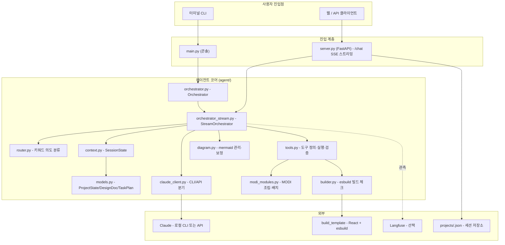
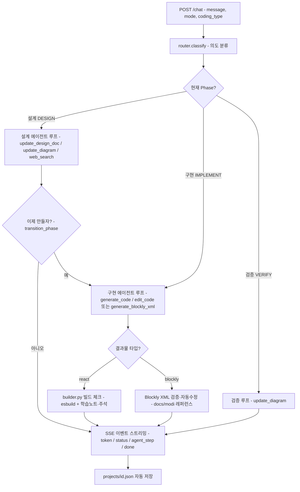

# 설계기획서 — 이슈 #1: 루트 README.md 작성

> 대상 저장소: `luxrobo/edu-agent` · 이슈 #1 (작성자 @csk6124, OPEN) · 라벨: agent-dev, design, docs
> 산출물 트랙: 이 문서(설계기획서) + `mockup.html`(README가 화면에서 어떻게 보일지 미리보기 시안)
> ※ 이 트랙에서는 **소스 코드를 고치지 않습니다.** 아래 "TO-BE"에 들어 있는 README 본문을
> 그대로 `README.md`로 저장하면 이슈가 완료됩니다.

---

## 1. 배경 / 목표

**무엇을:** 저장소 루트에 프로젝트 전체를 설명하는 `README.md`를 새로 만든다.
**왜:** 이슈 #1의 요구사항이 "README.md를 만들어 **전체 아키텍처·구성도·에이전트 프로세스**를
mermaid로 설명"하는 것인데, 확인 결과 **루트에 README가 전혀 없다**(아래 단언 A-1).
즉 새로 온 사람이 이 프로젝트가 무엇이고, 어떤 파일이 무슨 일을 하며, 어떻게 실행하는지
한눈에 알 길이 없다.

이 프로젝트는 한 줄로 말하면 **"학습자가 한국어로 만들고 싶은 것을 말하면, AI 에이전트가
같이 설계하고 코드(또는 MODI 하드웨어 블록)까지 만들어 주는 교육용 바이브코딩 도구"**다
(FastAPI 앱 제목이 "교육용 바이브코딩 에이전트" — 단언 A-2).

요청 본문 범위 밖의 기능 추가·정책 변경은 하지 않는다. README는 **있는 코드를 정확히 설명**하는
문서일 뿐이다.

---

## 2. 검증된 사실 (코드 계보 단언)

README에 적을 모든 설명은 아래처럼 **실제 파일·라인으로 추적해 확정한 사실**만 쓴다.
추측·날조 금지. (지표 대시보드가 아니라 문서이므로, "데이터 계약" 대신 "사실 계보"로 추적했다.)

| # | 단언 (한 문장) | 근거 (파일:라인) |
|---|---|---|
| A-1 | 루트에 README가 존재하지 않는다 → 신규 작성 대상이다. | `ls README*` → "NO README" (저장소 루트) |
| A-2 | 서비스 정체성은 "교육용 바이브코딩 에이전트"이며 FastAPI 앱이다. | `server.py:16` `FastAPI(title="교육용 바이브코딩 에이전트")` |
| A-3 | **진입점이 두 개**다: 웹/API 서버(`server.py`)와 터미널 CLI(`main.py`). | `server.py:16`, `main.py:41-96` |
| A-4 | 웹 서버는 `StreamOrchestrator`, CLI는 `Orchestrator`를 쓴다(둘 다 같은 코어). | `server.py:9,30`, `agent/orchestrator.py:8-26` |
| A-5 | `/chat`은 SSE 스트리밍 응답이다(`text/event-stream`, `data: {json}` 라인). | `server.py` `event_stream()` + `StreamingResponse(media_type="text/event-stream")` |
| A-6 | 한 대화는 `session_id`로 구분되고, 메모리 dict에 보관 + `projects/{id}.json`으로 디스크 저장/자동복원된다. | `server.py` `sessions: dict`, `auto_save`, `_restore_state_from_file`, `SAVE_DIR="projects"` |
| A-7 | 요청 파라미터는 `mode`(design\|quick)와 `coding_type`(react\|blockly)로 동작이 갈린다. | `server.py` `class ChatRequest` |
| A-8 | 에이전트는 **3단계(Phase)**: 설계(DESIGN) → 구현(IMPLEMENT) → 검증(VERIFY). | `agent/models.py` `class Phase` |
| A-9 | 의도 분류기(Router)는 **API 호출 없는 키워드 규칙**이며, 설계 단계에선 무조건 일반 설계 대화로 보낸다(설계→구현 전환은 키워드가 아니라 에이전트가 `transition_phase` 도구로 판단). | `agent/router.py` `Router.classify` |
| A-10 | 에이전트가 쓸 수 있는 도구는 11종이며 **Phase별로 허용 도구가 다르다**. | `agent/tools.py` `TOOL_DEFINITIONS`, `get_tools_for_phase` (`DESIGN_TOOLS`/`IMPLEMENT_TOOLS`/`BLOCKLY_IMPLEMENT_TOOLS`/`VERIFY_TOOLS`) |
| A-11 | 도구 목록: update_design_doc, plan_tasks, complete_task, update_diagram, generate_code, edit_code, add_learning_note, add_code_annotation, web_search, generate_blockly_xml, transition_phase. | `agent/tools.py` `TOOL_DEFINITIONS` |
| A-12 | 다이어그램은 mermaid 문자열로 관리되며, LLM이 자주 틀리는 문법을 `_sanitize_mermaid`가 자동 보정한다. | `agent/diagram.py` `DiagramManager`, `_sanitize_mermaid` |
| A-13 | React 코드 생성 후엔 `build_template`에서 **esbuild로 번들 빌드 체크**를 돌려 검증한다(App.tsx 진입). | `agent/builder.py` `build_check`/`_build_check_locked`, `build_template/package.json` |
| A-14 | MODI(blockly) 모드는 코드 대신 **Blockly XML**을 만들고, `docs/modi/`의 레퍼런스로 XML을 검증·자동수정한다. | `agent/tools.py` `load_modi_core`, `validate_blockly_xml`, `docs/modi/modi_core.md` + `ref/*.md` |
| A-15 | LLM 호출은 기본적으로 **로컬 Claude CLI(구독 인증)** 를 쓰고, `USE_LOCAL_CLAUDE=false`면 Anthropic API 키로 직접 호출한다. | `agent/claude_client.py` `_use_local_cli`, `create_client`; `.env` `USE_LOCAL_CLAUDE` |
| A-16 | 관측(Langfuse)은 선택이다 — 키가 없으면 사실상 no-op. | `server.py` `_langfuse_enabled`, `agent/orchestrator_stream.py` `@observe`/`score_current_trace` |
| A-17 | 의존성: anthropic, pydantic, fastapi, uvicorn, langfuse, python-dotenv (Python ≥ 3.11). 실행: `make run` = uvicorn 8000 포트. | `pyproject.toml`, `Makefile` |
| A-18 | CLI 콘솔 명령: `/diagram` `/phase` `/files` `/reset` `/quit`. | `main.py` `print_header`, 명령 분기 |

**README에 쓰면 안 되는 것(근거 없음 → 날조 위험):** 테스트 스위트·CI·Docker·라이선스 파일은
저장소에서 발견되지 않았다. README에 "테스트: …", "라이선스: MIT" 같은 문구를 임의로 적지 않는다
(아래 "열린 질문" 참고).

---

## 3. AS-IS / TO-BE

### AS-IS
- 루트에 README **없음**(단언 A-1). 신규 개발이므로 기존 화면 재현(AS-IS) 단계는 건너뛴다.

### TO-BE — 제안하는 README.md 구성
GitHub에서 바로 보기 좋게, 위→아래로 다음 순서. **mermaid 다이어그램 2개**(아키텍처 구성도 +
에이전트 프로세스 흐름도)를 포함한다(이슈 요구사항 충족).

1. **제목 + 한 줄 소개** — "교육용 바이브코딩 에이전트"
2. **이게 뭔가요?** (비개발자용 3~4줄 설명)
3. **핵심 개념** — 모드(design/quick) × 타입(react/blockly), 3단계(설계→구현→검증)
4. **전체 아키텍처 구성도** — ```mermaid``` 다이어그램 ①
5. **에이전트 처리 프로세스 흐름도** — ```mermaid``` 다이어그램 ②
6. **디렉터리 / 모듈 설명** — 표로 `server.py`, `main.py`, `agent/*`, `build_template`, `docs/modi`
7. **설치 / 실행 방법** — 의존성 설치, `.env`, `make run`(웹) / CLI 실행
8. **API 엔드포인트 요약** — `/chat` 등
9. **참고/주의** — 로컬 CLI vs API, Langfuse 선택, 열린 질문 표기

> README 전문(붙여넣기용 초안)은 이 문서 **부록 A**에 그대로 들어 있다.
> `mockup.html`은 이 README가 GitHub에서 렌더링됐을 때의 모습(다이어그램을 SVG로 미리 그림)을 보여준다.

---

## 4. 구현 단계 & 진입점

문서 한 개를 만드는 작업이라 분할하지 않는다(리드 판단: solo). 작업 순서:

1. **사실 확정(완료)** — 위 2장의 단언 표. 진입점은 `server.py`, `main.py`, `agent/orchestrator_stream.py`,
   `agent/router.py`, `agent/tools.py`, `agent/models.py`, `agent/context.py`, `agent/diagram.py`,
   `agent/builder.py`, `agent/claude_client.py`, `build_template/package.json`.
2. **README 작성** — 부록 A 본문을 루트 `README.md`로 저장. (이 트랙은 시안까지만; 실제 저장은 후속.)
3. **다이어그램 검증** — mermaid 코드 2개가 GitHub에서 렌더되는지 확인(문법: flowchart TD, subgraph).

- **프론트/백 구분:** 해당 없음(순수 문서). 백엔드 동작 설명만 있고 새 코드는 없음.
- **위험/주의:**
  - mermaid 노드 라벨에 `/`, `()` 등 특수문자가 들어가면 GitHub가 깨질 수 있다 → 라벨은 따옴표로
    감싸거나 한글+화살표 정도로 단순화한다(코드의 `_sanitize_mermaid`가 하는 보정과 같은 취지).
  - 코드에 없는 사실(테스트/라이선스/배포)을 적지 않는다 — 6장으로.

---

## 5. 완료 조건 (Acceptance)

- [ ] 저장소 루트에 `README.md`가 생성된다.
- [ ] README에 **mermaid 다이어그램이 1개 이상**(제안: 아키텍처 + 에이전트 프로세스 2개) 포함된다.
- [ ] `server.py`(진입점), `agent/*` 모듈군, `build_template` 구성이 **실제 코드 기준으로 정확히** 기술된다.
- [ ] 설치/실행 방법(`make run`, `.env`, CLI)이 들어간다.
- [ ] 이슈 본문 범위 밖의 기능·정책을 임의로 덧붙이지 않는다.
- [ ] 근거 없는 항목(테스트/라이선스 등)은 단정하지 않는다.

---

## 6. 열린 질문 (사람 결정 필요)

1. **라이선스** — 저장소에 LICENSE 파일이 없다. README에 라이선스 배지/문구를 넣을지, 넣는다면 무엇인지?
   (사내 비공개라면 "사내용/비공개"로 표기 권장.)
2. **테스트/CI** — 테스트 스위트와 CI 설정이 안 보인다. README에 "테스트 실행" 섹션을 비워둘지,
   "현재 없음"으로 명시할지?
3. **`.env` 샘플 제공 여부** — 실제 `.env`엔 키가 들어 있다. README에 `.env.example`(키 값은 비움)
   안내를 넣을지? (보안상 권장)
4. **공개 범위** — 이 README가 외부 공개용인지 사내용인지에 따라 톤/배지/연락처가 달라진다.

---

# 부록 A — README.md 본문 초안 (그대로 붙여넣기용)

````markdown
# 교육용 바이브코딩 에이전트 (edu-agent)

만들고 싶은 것을 **한국어로 말하면**, AI 에이전트가 함께 **설계**하고
**코드(웹·앱)** 또는 **MODI 하드웨어 블록**까지 만들어 주는 교육용 도구입니다.
"바이브코딩"을 배우는 학습자가, 코드를 몰라도 자기 아이디어를 실제로 굴려볼 수 있게 돕습니다.

## 이게 뭔가요?

- 학습자가 "배달 앱 만들고 싶어" 처럼 말하면, 에이전트가 되묻고 정리하며 **설계도**를 같이 그립니다.
- 충분히 이야기가 되면 에이전트가 **코드를 생성**하고, 그 결과를 미리보기로 보여줍니다.
- 생성된 코드는 esbuild로 **빌드가 되는지 자동 점검**하고, 학습자를 위해 **학습 노트·코드 설명**도 붙여 줍니다.
- 두 가지 결과물 타입을 지원합니다.
  - **react**: 웹/앱 화면 코드(JSX)
  - **blockly**: LUXROBO **MODI** 하드웨어용 블록(Blockly XML) — 모터·LED·센서 등

## 핵심 개념

- **모드 (`mode`)**: `design`(설계부터 차근차근) / `quick`(설계 건너뛰고 바로 만들기)
- **타입 (`coding_type`)**: `react`(웹·앱) / `blockly`(MODI 하드웨어)
- **3단계 (Phase)**: `설계(DESIGN)` → `구현(IMPLEMENT)` → `검증(VERIFY)`
- **세션 (`session_id`)**: 대화 단위. 메모리에 두고 `projects/<session_id>.json`으로 저장·복원됩니다.

## 전체 아키텍처 구성도



## 에이전트 처리 프로세스 흐름도

`server.py /chat` 요청이 들어온 뒤 `StreamOrchestrator`가 한 턴을 처리하는 흐름입니다.



## 디렉터리 / 모듈 설명

| 경로 | 역할 |
|---|---|
| `server.py` | **웹/API 진입점.** FastAPI 앱. `/chat`(SSE 스트리밍), 세션 저장·복원·삭제, 프로젝트 목록 API. |
| `main.py` | **터미널 CLI 진입점.** `/diagram` `/phase` `/files` `/reset` `/quit` 명령 지원. |
| `agent/orchestrator_stream.py` | **스트리밍 오케스트레이터(StreamOrchestrator).** 한 턴의 전체 흐름(라우팅→에이전트 루프→검증·후처리)을 담당. |
| `agent/orchestrator.py` | CLI용 얇은 래퍼(Orchestrator). 내부적으로 StreamOrchestrator 사용. |
| `agent/router.py` | API 호출 없는 **키워드 기반 의도 분류기.** 설계 단계에선 항상 설계 대화로 보냄. |
| `agent/tools.py` | 에이전트 **도구 11종 정의·실행** + MODI 코어 로딩(`load_modi_core`) + Blockly XML 검증/자동수정. Phase별 허용 도구가 다름. |
| `agent/models.py` | **도메인 모델.** `Phase`, `DesignDoc`, `TaskPlan`, `ProjectState` 등(pydantic). |
| `agent/context.py` | **세션 상태(SessionState).** 대화 히스토리, 생성 코드, 학습 노트, 다이어그램 등을 보관·요약. |
| `agent/diagram.py` | mermaid 다이어그램 관리 + LLM 문법 오류 자동 보정(`_sanitize_mermaid`). |
| `agent/builder.py` | 생성된 React 코드를 **esbuild로 번들 빌드 체크.** |
| `agent/modi_modules.py` | MODI 하드웨어 **모듈 배치·조립 가이드** 생성(blockly 모드). |
| `agent/claude_client.py` | **LLM 호출 분기.** 기본은 로컬 Claude CLI(구독 인증), `USE_LOCAL_CLAUDE=false`면 Anthropic API. |
| `agent/prompts.py` | 단계·모드별 시스템 프롬프트 모음. |
| `build_template/` | 빌드 체크용 React 템플릿(React 18, react-router, lucide-react, esbuild). |
| `docs/modi/` | MODI 코어 문서(`modi_core.md`)와 모듈별 레퍼런스(`ref/*.md`). Blockly 검증의 근거. |
| `projects/` | 세션 저장 폴더(`<session_id>.json`). (git에는 올리지 않음) |

## 설치 / 실행

### 요구 사항
- Python **3.11 이상**
- 의존성: `anthropic`, `pydantic`, `fastapi`, `uvicorn`, `langfuse`, `python-dotenv`
- (기본 동작) 로그인된 **Claude CLI** 또는 (`USE_LOCAL_CLAUDE=false`일 때) **Anthropic API 키**

### 1) 가상환경 + 설치
```bash
python -m venv .venv
source .venv/bin/activate
pip install -e .
```

### 2) 환경변수(.env)
```dotenv
ANTHROPIC_API_KEY=...        # USE_LOCAL_CLAUDE=false 일 때만 필요
USE_LOCAL_CLAUDE=true        # true=로컬 Claude CLI(구독 인증) / false=API 직접 호출
# Langfuse (선택 — 비워두면 비활성화)
LANGFUSE_SECRET_KEY=
LANGFUSE_PUBLIC_KEY=
LANGFUSE_HOST=
```

### 3) 실행
**웹/API 서버**
```bash
make run
# = uvicorn server:app --host 0.0.0.0 --port 8000 --reload
```

**터미널 CLI**
```bash
python main.py
```

## API 엔드포인트 요약

| 메서드 | 경로 | 설명 |
|---|---|---|
| POST | `/chat` | 메시지를 보내고 **SSE 스트리밍**으로 응답 받기 (`session_id`, `message`, `mode`, `coding_type`). |
| POST | `/chat/stop` | 진행 중인 응답 중단. |
| GET | `/session/{id}` | 현재 단계(phase)와 다이어그램 조회. |
| POST | `/session/{id}/reset` | 세션 초기화. |
| POST | `/session/{id}/save` | 세션을 `projects/<id>.json`으로 저장. |
| POST | `/session/{id}/restore` | 저장된 세션 복원. |
| GET | `/projects` | 저장된 프로젝트 목록. |
| GET | `/projects/{filename}` | 특정 프로젝트 불러오기. |
| DELETE | `/projects/{filename}` | 프로젝트 삭제. |

## 참고 / 주의

- 기본은 **로컬 Claude CLI**(구독 인증)로 동작합니다. API 키로 바꾸려면 `.env`에서
  `USE_LOCAL_CLAUDE=false`로 두고 `ANTHROPIC_API_KEY`를 넣으세요.
- **Langfuse**는 선택입니다. 키가 없으면 자동으로 비활성화됩니다.
- 라이선스/테스트/배포(CI) 항목은 현재 저장소에 별도 설정이 없습니다.
<!-- (확정되면 이 줄을 채우세요: 라이선스, 테스트 실행법 등) -->
````
