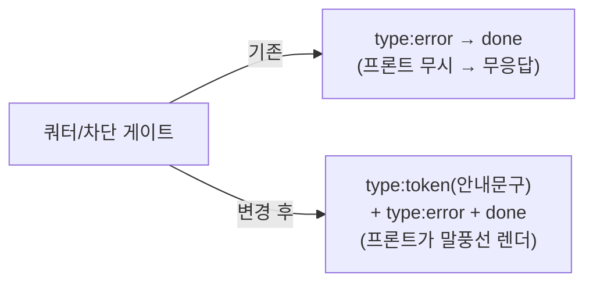

# 채팅 무응답(쿼터 차단 미표시) 해소 + usage_turns 500 설계문서

> 작성: Claude Opus 4.8 + walter | 날짜: 2026-07-13 | 상태: Draft
> 규칙: 이 문서는 관련 코드를 실제로 읽고 재현 검증한 뒤 작성됨(§2 근거·재현 참조).

## 1. 배경과 목표

쿼터를 켠 뒤(`QUOTA_ENABLED=true`, 하루 3턴) 실제 학생들이 **4턴째부터 빈 화면("무응답")**을 겪는다. 원인은 코드 버그가 아니라 **최근 배포 설정 플립**이다: 커밋 `8476ea5`(QUOTA ON)·`5c71520`(턴 상한 5→3)로 `deploy/onprem.env`가 바뀌면서, 그 전엔 no-op이던 쿼터 게이트가 4턴째부터 차단을 시작했다.

서버는 차단 시 `type:"error"` SSE 이벤트에 한국어 안내 문구를 실어 **정상적으로 보낸다**(재현으로 확인 — §2). 그러나 외부 프론트(ai.modiplanet.com)는 정상 응답인 `type:"token"`만 렌더하고 `type:"error"`는 무시하므로 화면에 아무것도 안 뜬다. 또 차단은 Sentry에 **error가 아니라 warning-level message(tag `load_constraint=user_quota`)**로만 남아 에러 뷰·알림에 안 잡힌다 → "Sentry에 메시지도 없다"의 정체.

이 설계의 목표: **쿼터가 소진되면 사용자에게 반드시 화면 메시지가 보이도록** 한다(사용자 지시: "쿼터 부족 시 클라이언트와 통신 메시지 추가 필요"). 정공법은 차단 스트림이 안내 문구를 **프론트가 이미 렌더하는 `type:"token"`으로도 병행 전송**하는 것 — 외부 프론트 수정 없이 즉시 말풍선에 뜬다. 동시에 구조화 `type:"error"`도 유지해 향후 프론트가 재시도 UI를 붙일 수 있게 한다. 곁다리로 매 턴 `/api/usage/add`가 반환하는 **500(Sentry #101 / 이슈 #145)**도 해소한다.

## 2. 현재 상태 (검증됨)

| 확인한 사실 | 근거 (파일:라인) |
|---|---|
| 배포 env가 `QUOTA_ENABLED=true`·`QUOTA_DAILY_MAX_TURNS=3` (기본값은 각각 off·0) | `deploy/onprem.env:32-33` / 기본값 `server.py:88,94` |
| 4턴째부터 `over_limit=True` (사용자별 하루 턴 수 ≥ 3) | `server.py:343-344` |
| 차단 시 `quota_exceeded_stream()`이 `type:"error"`(+`retry_after`) → `type:"done"`만 방출 | `server.py:352-355` |
| 차단 목록 `blocked_stream()`도 `type:"error"`(BLOCKED) → `done`만 방출 | `server.py:330-333` |
| 세션 중복 `busy_stream()`도 `type:"error"`(SESSION_BUSY) → `done`만 | `server.py:366-369` |
| **정상 응답 텍스트는 `{"type":"token","text":...}`로 프론트에 렌더됨** | `orchestrator_stream.py:830-831, 890, 916` |
| 에러 이벤트 스키마·6개 code·한국어 문구는 카탈로그로 완비 | `agent/errors.py:45-122` (`error_event`) |
| 쿼터 차단은 Sentry에 **warning-level message**(tag `load_constraint`)로만 기록 — exception 아님 | `server.py:348-349` → `agent/observability.py:280-295` |
| 실제 크래시라면 `capture_chat_exception`으로 error가 떴을 것(안 떴다 = 차단이 원인) | `server.py:384` |
| `quota_store`·`session_locks`는 `REDIS_URL` 미설정 → **InMemory**(프로세스별, 재시작 시 리셋) | `server.py:81-82,107`; onprem.env에 `REDIS_URL` 없음 |
| 프론트 코드는 이 리포에 **없음**(서빙 정적파일은 `simulate.html`·`rag_demo.html`뿐) | `server.py:306`; `ls scripts/*.html` |
| `usage_turns` DDL은 `CREATE TABLE IF NOT EXISTS`라 기존 MySQL 볼륨엔 재적용 안 됨 → INSERT 실패 → 500 | `deploy/schema.sql:75`; `scripts/store_mysql.py:113`; `scripts/rag_demo_app.py:268-279` |
| usage writeback은 fail-open(500이어도 /chat 안 막음) | `server.py:427-453`, `_usage_writeback_upstream` `server.py:789-799` |

**재현(실제 함수 import):** `quota.make_quota_store('')`+`errors.error_event`로 5턴 시뮬레이션 → 턴 1~3 정상, **턴 4+에서 서버가 다음 바이트를 방출**함을 확인:
```
data: {"type": "error", "code": "quota_exceeded", "message": "사용 한도에 도달했어요. 잠시 후 다시 시도해주세요.", "retryable": false, "retry_after": <초>}
data: {"type": "done"}
```
→ 서버 무응답·행(hang) 없음. 스트림은 `done`으로 정상 종료. **문제는 오직 프론트가 `type:"error"`를 렌더하지 않는 것.**

**미확인:** 배포 프론트(ai.modiplanet.com)가 정확히 어떤 `type`을 렌더/무시하는지 소스로는 확인 불가(외부 리포). 단, 정상 응답이 보였다는 사실 = `type:"token"`은 렌더함(역추론). 이 설계는 그 역추론에 기댄다.

## 3. 설계

### 3.1 변경 개요

세 갈래(A 백엔드 수정 = 이 설계 핵심 / B 프론트 인계 문서 / C usage_turns 500):



**A. (핵심) 차단 스트림에 렌더 가능한 `token` 메시지 병행** — `server.py`
- 차단 3경로(`quota_exceeded_stream`·`blocked_stream`·`busy_stream`)가 `error_event` 앞에 **카탈로그 user_message를 `{"type":"token","text":...}`로 먼저 방출**한다. 문구는 신규 작성 없이 `CATALOG[code].user_message`를 그대로 재사용.
- 킬스위치 env `SSE_ERROR_AS_TOKEN`(기본 `true`)로 병행 여부 제어 — 향후 프론트가 `type:"error"`를 네이티브 렌더하면 `false`로 꺼서 중복 렌더를 없앤다.
- 순서: `token`(사람이 볼 문구) → `error`(구조화 메타) → `done`. 오늘 프론트는 token만 그리므로 **중복 렌더 없음**; 미래 프론트는 error를 그리고 token 폴백을 무시하도록 계약(B)에 명시.

**B. SSE 에러 계약 문서** — `docs/api/sse-error-contract.md`(신규, 런타임 무변경)
- `/chat`은 항상 HTTP 200 + SSE. 오류는 상태코드가 아니라 본문 `type:"error"`로 온다(429/409 기대 금지).
- 6개 `code` 전량·`message`·`retryable`·`retry_after`·`token` 폴백 규약을 표로 SSOT 고정.
- 프론트 처리 규약: `type:"error"` 렌더(말풍선/토스트), `retryable`이면 재시도, `retry_after`면 카운트다운. `SSE_ERROR_AS_TOKEN` 폴백 token은 error를 네이티브 렌더하면 무시.

**C. usage_turns 500 해소** — `deploy/` + `scripts/`
- 실행 중 rag-onprem MySQL에 `usage_turns` 테이블을 `deploy/schema.sql` DDL로 반영(멱등).
- 재발 방지: 스키마를 기존 볼륨에도 재적용하는 **명시적 경로**(`scripts/apply_schema.py` 또는 기존 확장 + `deploy/README.md` 런북 단계).

### 3.2 인터페이스 계약

```python
# server.py — 신규 env(기존 QUOTA_* 옆)
SSE_ERROR_AS_TOKEN = os.getenv("SSE_ERROR_AS_TOKEN", "true").strip().lower() in ("true","1","yes")

# server.py — 차단 스트림 공통 형태(예: quota_exceeded_stream)
def quota_exceeded_stream():
    if SSE_ERROR_AS_TOKEN:
        yield _sse_chunk({"type": "token", "text": CATALOG[ErrorCode.QUOTA_EXCEEDED].user_message})
    yield _sse_chunk(error_event(ErrorCode.QUOTA_EXCEEDED, retry_after=retry_after))
    yield _sse_chunk({"type": "done"})
# blocked_stream / busy_stream 도 동형(각 code의 user_message).
```
```
# docs/api/sse-error-contract.md 이벤트 스키마(현행 그대로 문서화)
{"type":"error","code":<str>,"message":<str>,"retryable":<bool>[,"retry_after":<int 초>]}
# SSE_ERROR_AS_TOKEN=true 이면 위 error 앞에 {"type":"token","text":<message>} 1건이 선행.
```

### 3.3 데이터 변경

- 코드/스키마 시그니처 변경 없음. `usage_turns`는 기존 DDL(`deploy/schema.sql:75`)을 **기존 볼륨에 재적용**할 뿐(`IF NOT EXISTS` → 멱등, 데이터 무해).

## 4. 하지 않는 것 (Non-goals)

- **프론트(ai.modiplanet.com) 코드 수정** — 외부 리포. 이 리포는 token 폴백 + 계약 문서만 낸다.
- **에러 카탈로그·문구 신규 작성/변경** — `agent/errors.py` 문구를 그대로 재사용. 새 code·새 카피 금지.
- **쿼터 정책 로직 변경** — `QUOTA_*` 게이트 판정(`server.py:319-355`)·`agent/quota.py`는 건드리지 않는다. (즉시 완화용 env 값 조정은 코드가 아닌 ops 액션 — §5.)
- **`type:"error"` → `type:"token"` 전면 대체** — error 이벤트는 유지한다. token은 폴백 병행일 뿐(킬스위치로 분리).
- **usage writeback을 fail-open이 아닌 하드 실패로 바꾸기** — 500 원인만 없애고 fail-open은 보존.
- **MySQL 앱 직접 접근** — rag-search 경유 제약 유지.
- **"느린 코드 생성(>90s)" 지연 최적화** — 별개 이슈.

## 5. 엣지 케이스와 결정 사항

| 상황 | 결정 |
|---|---|
| 즉시 완화(실학생 이미 차단 중) | **ops 액션으로 분리**: `deploy/onprem.env`에서 `QUOTA_DAILY_MAX_TURNS` 상향 또는 `QUOTA_ENABLED=false`로 되돌려 즉시 언블록 가능. 이슈 아님(설정 변경) — 상위 추적 이슈에 명시. |
| 현재 프론트가 token+error 둘 다 렌더할 위험 | 오늘 프론트는 token만 렌더 → 중복 없음. 미래 프론트는 error 렌더 시 token 폴백 무시(계약 명시) + `SSE_ERROR_AS_TOKEN=false`로 서버측 차단 가능. |
| `busy`/`internal`에도 token 병행? | `quota_exceeded`·`blocked`·`session_busy` 3개 차단 게이트에 적용. 스트림 중간 INTERNAL(`server.py:387`)은 이미 토큰이 흘렀을 수 있어 이번 범위서 제외(별도 판단). |
| 스키마 재적용 안전성 | `CREATE TABLE IF NOT EXISTS`뿐 → 재실행·기존 데이터 무해(멱등). 컬럼 추가형 마이그레이션은 미래에 `ALTER` 분기 별도 설계. |
| usage_turns 반영 후에도 writeback | fail-open 유지 — MySQL 순단 시에도 /chat 안 막힘(현 동작 보존). |
| InMemory 쿼터 + 멀티워커 | 카운터가 프로세스별이라 실효 상한이 워커 수만큼 커질 수 있음(관측 사항). 이번 범위서 정책 변경 안 함 — 필요 시 `REDIS_URL` 배선은 별개 이슈. |

## 6. 구현 이슈 분해

세 이슈는 코드 앵커가 서로소(server.py / docs·api / deploy·scripts)라 **병렬 착수 안전**.

| # | 이슈 제목 | 의존 | 검증 명령어 |
|---|---|---|---|
| 1 | [Task] 차단 시 렌더 가능한 token 안내 병행 전송 (킬스위치 SSE_ERROR_AS_TOKEN) | 없음 | `pytest tests/test_quota_turns.py -q` + 신규 단위테스트: quota/blocked/busy 스트림에 `type:"token"` 1건 선행 확인 |
| 2 | [Task] SSE 에러 이벤트 계약 문서화 (프론트 인계) | 없음 | `docs/api/sse-error-contract.md` 존재 · 6 code·필드·token 폴백 규약이 `agent/errors.py`와 대조 일치 |
| 3 | [Task] usage_turns 테이블 반영 + 스키마 재적용 경로 | 없음 | 스키마 재적용 스크립트/런북 추가 · 배포 후 `/api/usage/add` 200 · `pytest tests/test_usage_persist.py -q` |

## 7. 전체 완료 기준

- [ ] `SSE_ERROR_AS_TOKEN=true`(기본)에서 4턴째 요청이 `type:"token"`(안내문구)+`type:"error"`+`done`을 방출 (단위테스트 통과)
- [ ] 외부 프론트 수정 없이 실제 4턴째 채팅에서 화면에 안내 말풍선이 뜸 (배포 후 수동 확인)
- [ ] `docs/api/sse-error-contract.md`가 현행 서버 동작과 일치
- [ ] 배포 후 `/api/usage/add`가 200 반환, usage_turns 적재, Sentry #101 정지
- [ ] 기존 테스트 전체 통과: `pytest -q`
