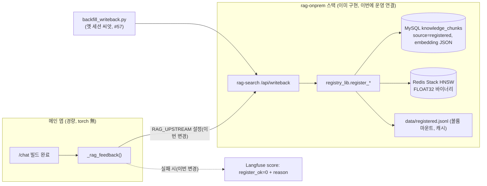

# 재사용 코퍼스 영속화 — mysql_redis 백엔드 운영 활성화 설계문서

> 작성: Claude (Opus 4.8) + walter | 날짜: 2026-07-09 | 상태: Draft
> 규칙: 이 문서를 쓰기 **전에** 관련 코드를 실제로 읽고 검증할 것. 상상으로 쓴 앵커는 구현을 실패시킨다.

## 1. 배경과 목표

운영(edu-agent.luxrobo.net)에서 코드 재사용 게이트가 사실상 항상 `none`/`register`로 떨어진다
(Langfuse 실측: 최근 40 트레이스 중 reuse 1건, top1 max 0.497 < TAU_REUSE 0.62; `/api/simulate`
실측: 코드턴 10건 중 재사용가능 1건). 근본 원인은 검색 품질이 아니라 **재사용 코퍼스가 비어 있고,
쌓여도 사라지는 것**이다:

1. base 코퍼스 821건은 전부 `intent=explain_concept` 학습노트 — 코드 자산(kind=code) 0건.
2. 런타임 등록물은 `data/registered.jsonl`+`registered_emb.npy` **플랫 파일**에 저장되는데,
   운영 compose가 `data/`를 볼륨 마운트하지 않아 **재배포마다 소멸**.
3. 등록 실패는 `print` 한 줄로 조용히 삼켜져 관측 불가.
4. MySQL(원천)+Redis Stack(HNSW 벡터) 영속 백엔드·백필·writeback 파이프라인(#57·#58)이
   **이미 구현돼 있으나 운영 환경변수에 연결되지 않음**.

**"MySQL에 바이너리로 저장하면 되나요?"에 대한 답**: 바이너리 포맷은 문제가 아니다. 설계상
검색용 벡터 바이너리는 이미 Redis(FLOAT32 HNSW, `vector_redis.f32()`)에 저장되고, MySQL
`knowledge_chunks.embedding`은 재구성용 원천 보존(JSON)이다. 문제는 **이 백엔드가 운영에
꺼져 있는 것**이므로, 해법은 신규 저장 포맷이 아니라 기존 mysql_redis 경로의 활성화 + 씨앗
백필 + 실패 관측이다.

이 변경 후: 등록물이 MySQL 원천 + Redis 벡터에 영속 저장되어 재배포에도 누적되고, 과거 세션
코드 자산이 씨앗으로 적재되어 재사용 게이트가 실제 후보를 찾으며, 등록 실패가 Langfuse에 보인다.

## 2. 현재 상태 (검증됨)

| 확인한 사실 | 근거 (파일:라인) |
|---|---|
| 등록 스토어는 플랫 파일 append(`registered.jsonl`) + npy 전체 재기록 | `scripts/registry_lib.py:22-23,167-170` |
| `RAG_BACKEND=mysql_redis`일 때만 Redis upsert + MySQL 이중 적재(best-effort) | `scripts/registry_lib.py:176-196` (`_mysql_register`) |
| 로컬 저장소에 `registered.jsonl`/`registered_emb.npy` 부재 = 등록물 0건 | `ls data/` 실측 (base 3파일만 존재) |
| 운영 compose에 `data/` 볼륨 마운트 없음 (`./projects`, claude 인증만 마운트) | `docker-compose.yml:60-62` |
| 온프렘 스택만 `./data:/app/data` 마운트 | `docker-compose.rag-onprem.yml:72,87` |
| write-back 실패는 except로 삼키고 print만 | `server.py:559-560` (`_rag_feedback`) |
| 프록시 모드면 `/api/writeback`으로 POST, 아니면 인프로세스 registry 호출 | `server.py:539-558` |
| 운영 오버레이에 `RAG_BACKEND`/`RAG_UPSTREAM` 없음 → 코드 기본값 `local` | `deploy/onprem.env` 전문, `scripts/search_lib.py:42` |
| MySQL 스키마 완비: `knowledge_chunks.embedding JSON`(원천), source=base\|registered | `deploy/schema.sql:26-51` |
| Redis는 FLOAT32 바이너리 HNSW/COSINE 색인 (`f32()` = `array('f').tobytes()`) | `scripts/vector_redis.py:43-45,67-68` |
| MySQL 적재는 `json.dumps(embedding)` (list(vec)는 과거 전건 실패 → 수정됨) | `scripts/store_mysql.py:140`, `registry_lib.py:219` 주석 |
| 씨앗 백필 이미 구현: 옛 세션 → `/api/writeback` 일괄, 멱등, torch 불필요 | `scripts/backfill_writeback.py:1-21` (#57) |
| base 자산 → MySQL/Redis 적재 스크립트 존재 | `scripts/backfill_onprem.py:54-116` |
| 운영 벡터 레이어 활성(`vector_enabled: True`), τ=0.62/0.48 | `/api/coverage` 운영 실측 |
| base 인덱스 821건 전부 `intent=explain_concept`, 코드 자산 0건 | `data/ontology.db` chunks 집계 실측 |
| writeback 테스트 존재(프록시 POST·로컬 registry·오류 삼킴) | `tests/test_rag_writeback.py:47,70,92` |
| 등록물 가시성 필터: base는 전역, registered는 본인/무주인만 | `scripts/search_lib.py:339-345` |

### 2.1 운영 `.95` 실측 (#102, 2026-07-09 확정)

`.95` 서버(hostname `lux`, 192.168.0.95)에서 `sudo docker` 로 직접 진단. 이슈 #102 인터페이스 계약의 4개 명령 출력 전문:

```console
# 진단1: 앱 컨테이너 RAG env
$ docker exec edu-agent sh -c 'echo "RAG_UPSTREAM=$RAG_UPSTREAM RAG_BACKEND=$RAG_BACKEND"'
RAG_UPSTREAM=http://host.docker.internal:8100 RAG_BACKEND=

# 진단2: 컨테이너 내 registered.jsonl 존재/행수
$ docker exec edu-agent sh -c 'wc -l /app/data/registered.jsonl 2>/dev/null || echo "registered.jsonl 없음"'
3071 /app/data/registered.jsonl

# 진단3: auto-register 건너뜀 로그 빈도 (현 컨테이너 기동 이후 로그 한정)
$ docker logs edu-agent 2>&1 | grep -c "auto-register 건너뜀"
0

# 진단4: rag-onprem 스택 기동 여부
$ docker ps --format "{{.Names}}" | grep -iE "rag|mysql"
edu-agent-rag-onprem
rag-mysql-view
edu-agent-rag-redis
edu-agent-rag-mysql
```

엣지 케이스(rag-onprem 스택이 이미 떠 있음)에 따라 스택 컨테이너 env·데이터도 함께 실측:

| 실측 사실 | 값 / 근거 |
|---|---|
| 앱 컨테이너 프록시 모드 **활성** | `RAG_UPSTREAM=http://host.docker.internal:8100` (앱의 `RAG_BACKEND`은 비어 있음 — 백엔드는 rag-search 소관) |
| rag-search 컨테이너 `RAG_BACKEND=mysql_redis`, `:8100` 노출, Up | `docker exec edu-agent-rag-onprem env` / `docker ps` |
| MySQL `edu_agent.knowledge_chunks` 적재 건수 | `base=821`, `registered=413` (`SELECT source,COUNT(*) … GROUP BY source`) |
| Redis 벡터 인덱스 존재·키 수 | `FT._LIST → idx:kchunks`, `DBSIZE → 3943` |
| 앱 컨테이너 `/app/data/registered.jsonl` | 3071행 존재(프록시 전환 이전 로컬 모드 잔존 파일로 추정 — 프록시 모드에선 write-back 이 upstream 으로 감) |

**함의 (후속 이슈 전제 갱신):**
- 표 33~40행의 "미확인/미배선" 전제와 달리, **운영은 이미 mysql_redis 프록시로 배선되어 동작 중**이다: 앱은 `:8100` 프록시, rag-search 는 `mysql_redis` 백엔드, MySQL 에 registered 413건·Redis 에 벡터 인덱스가 실재한다.
- 따라서 #105(운영 배선)는 "신규 배선"이 아니라 **현 배선을 `deploy/onprem.env`·런북으로 명문화·재현 가능화**하는 작업으로 축소된다(현재 `RAG_UPSTREAM`이 오버레이 파일이 아닌 다른 경로로 주입되고 있는지 확인 포함).
- 진단3의 `0`은 **현 컨테이너 기동(수 분 전) 이후 로그 한정**이라 "무음 실패 없음"의 확정 근거는 아니다 — 실패 관측은 #104(Langfuse register_ok)로 상시 가시화해야 한다.
- 앱 컨테이너의 3071행 `registered.jsonl`은 #103 볼륨 마운트로 이제 호스트 `./data`에 영속되나, 프록시 모드에선 검색 원천이 아니다(참고용).

## 3. 설계

### 3.1 변경 개요



코드 신규 작성은 최소화한다 — 파이프라인은 #57/#58로 완성돼 있고, 이번 작업의 본질은
**(a) 운영 배선(env/compose/볼륨), (b) 씨앗 백필 실행 절차, (c) 실패 관측성** 3가지다.

### 3.2 인터페이스 계약

```python
# server.py — _rag_feedback 실패 관측 (이슈 3)
def _rag_feedback(session_id: str, user_id: str | None, state) -> None:
    ...
    except Exception as e:
        print(f"[rag] auto-register 건너뜀: {e}", flush=True)   # 유지
        _score_register_fail(reason=type(e).__name__)            # 신규: Langfuse score

# Langfuse score (orchestrator_stream.py:731-773 의 기존 score 패턴과 동형)
# name="등록 성공 (register_ok)", value=1|0, BOOLEAN
# 실패 시 name="등록 스킵사유 (register_skip_reason)", stringValue=<예외타입>, CATEGORICAL

# registry_lib.py — 등록 스토어 통계 (이슈 2)
def stats() -> dict:
    """반환: {count: int, last_registered_at: str|None, backend: 'local'|'mysql_redis'}"""

# server.py — 상태 노출 (이슈 2)
# GET /api/registry/stats → registry_lib.stats() + {upstream: bool}
# (프록시 모드면 rag-search /api/registry/stats 로 위임)
```

```yaml
# docker-compose.yml app 서비스 (이슈 2) — data/ 지속 볼륨
volumes:
  - ./data:/app/data          # 등록 스토어 영속(로컬 폴백·경량 배포 안전망)

# deploy/onprem.env (이슈 4) — 운영 배선
RAG_UPSTREAM=http://host.docker.internal:8100   # rag-onprem 스택의 rag-search
```

### 3.3 데이터 변경

- MySQL 스키마 변경 **없음** (`deploy/schema.sql` 그대로 사용. embedding JSON 유지 —
  검색은 Redis 바이너리 담당이므로 BLOB 전환은 이득 없음, §4 참고).
- 씨앗 백필: `backfill_onprem.py`(base 821건) + `backfill_writeback.py`(옛 세션
  `projects/<uid>/session_*.json`) 실행. 둘 다 멱등(중복 등록 방지 내장) — 재실행 안전.
- 기존 `data/registered.*` 파일: 운영에 존재하지 않음(실측) → 마이그레이션 불요.

## 4. 하지 않는 것 (Non-goals)

- **MySQL embedding 컬럼의 JSON→BLOB(바이너리) 전환**: 검색용 바이너리는 Redis가 담당하고
  MySQL은 원천 보존·재구성용. BLOB 전환은 저장 공간 최적화일 뿐 이번 문제(영속성 부재)와
  무관하며, `store_mysql.py`/`backfill_onprem.py`/hydrate 경로 전반의 직렬화 수정을 유발한다.
- **검색 알고리즘·임계값(TAU_REUSE/TAU_NEAR/W_*) 변경**: 코퍼스가 채워진 뒤 실트래픽으로
  별도 캘리브레이션(EDU-67 TAU 스윕 트랙). 이번 범위에서 `search_lib.py` 점수식 수정 금지.
- **LLM temperature/재현성 작업**: 별개 트랙. `claude_client.py` 수정 금지.
- **base 자산(`chunk_emb.npy`/`chunk_meta.json`/`ontology.db`) 재빌드·수정**: canonical 자산은
  커밋 기준(gold 회귀 기준점). 이슈 44 원칙 유지 — 로컬 재빌드 금지.
- **registry_lib의 파일 포맷(JSONL/npy) 교체**: mysql_redis 모드에서 파일은 로컬 캐시 역할로
  유지. 파일 경로 제거·리팩터링 금지.

## 5. 엣지 케이스와 결정 사항

| 상황 | 결정 |
|---|---|
| 메인 앱에 torch 없음 — 직접 mysql_redis 불가 | 메인 앱은 `RAG_UPSTREAM` 프록시 유지(경량). 임베딩·등록은 rag-search가 담당 (기존 #58 설계 준수) |
| `RAG_UPSTREAM` POST 실패(rag-search 다운) | 기존대로 예외 삼키되(저장 경로 보호, `server.py:526`) Langfuse `register_ok=0` score로 가시화. 재시도 큐는 범위 밖 |
| 백필 중복 실행 | `register_learning_notes`/`register_result`가 (session_id, title) 멱등 — 재실행 허용, 검증은 전후 count 비교 |
| 등록물 가시성 | 기존 `_visible()` 규칙 유지(base 전역, registered는 본인/무주인). 씨앗 백필 등록물은 원 세션 user_id 보존 |
| rag-onprem과 메인 compose 네트워크 분리 | 기존 결정 유지(세션락 redis 오염 사고 전례) — 별도 프로젝트로 기동, 포트(8100)로만 통신 |
| compose `data/` 마운트가 이미지 내 base 자산을 가림 | 호스트 `./data`에 base 3파일이 이미 존재(빌드 원천)하므로 동일 내용. 배포 런북에 "호스트 data/ 에 base 자산 존재 확인" 단계 명시 |
| Langfuse score 추가 위치 | `orchestrator_stream.py:731-773`의 기존 `score_current_trace` 패턴·한글 라벨 컨벤션 동형으로 |

## 6. 구현 이슈 분해

| # | 이슈 제목 | 의존 | 검증 명령어 |
|---|---|---|---|
| 1 | [Task] 운영 진단: 컨테이너 RAG env·등록파일·스킵로그 실측 + 결과를 이 문서 §2 미확인란에 기록 | 없음 | `.95`에서 `docker exec` 3종 (본문 명시) — 산출물은 문서 갱신 PR |
| 2 | [Task] `data/` 지속 볼륨 마운트 + `/api/registry/stats` 엔드포인트 + `registry_lib.stats()` | 없음 | `pytest tests/test_rag_writeback.py tests/test_server_rag.py -q` + `docker compose config` 렌더 확인 |
| 3 | [Task] write-back 실패 Langfuse 관측(`register_ok`/`register_skip_reason` score) | 없음 | `pytest tests/test_rag_writeback.py tests/test_observability.py -q` |
| 4 | [Task] 운영 mysql_redis 배선: `onprem.env`에 `RAG_UPSTREAM` + rag-onprem 기동·백필 런북(deploy/README) | #1 | `docker compose -f docker-compose.rag-onprem.yml config` + 런북 문서 리뷰 |
| 5 | [Task] 씨앗 백필 실행·검증: `backfill_onprem` + `backfill_writeback --dry-run→실행`, 전후 count·simulate 게이트 확인 | #4 | `python scripts/backfill_writeback.py --dry-run` + `/api/registry/stats` count>0 + `/api/simulate` 코드턴 decision≠none |

각 이슈는 파일 5개·300라인 diff 이내. #2·#3은 병렬 착수 가능, #4는 #1의 실측 결과 반영,
#5는 운영 작업(코드 diff 최소).

## 7. 전체 완료 기준

- [ ] `pytest -q` 전체 통과 (기존 writeback·server_rag·observability 테스트 포함)
- [ ] 운영 재배포(컨테이너 재생성) 후 `/api/registry/stats` count가 0으로 리셋되지 않음
- [ ] `python scripts/simulate_batch.py https://edu-agent.luxrobo.net` — 코드턴 재사용가능
      (reuse+review) 비율이 백필 후 10% → 상승 확인(수치는 백필 규모에 따름)
- [ ] Langfuse에서 `register_ok` score 조회 가능 (실패 발생 시 `register_skip_reason` 확인 가능)
- [ ] `deploy/README.md` 런북만 보고 신규 서버에서 rag-onprem 스택 + 백필 재현 가능
