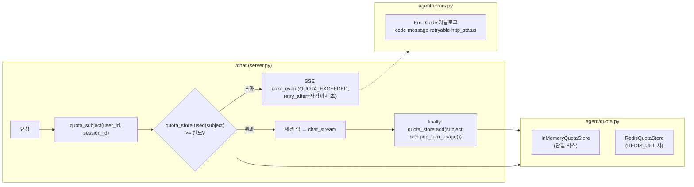

# 사용자 토큰 쿼터 + 에러 응답 구조화 설계문서

> 작성: Claude Fable 5 + walter | 날짜: 2026-07-13 | 상태: Draft
> 규칙: 이 문서를 쓰기 **전에** 관련 코드를 실제로 읽고 검증할 것. 상상으로 쓴 앵커는 구현을 실패시킨다.

## 1. 배경과 목표

현재 사용자별 토큰 사용량을 **제한하는 장치가 전혀 없다**. 토큰/비용은 Langfuse로 계측만 되고(사후 관측), 한 사용자가 무한정 턴을 돌려도 서버는 막지 않는다 — 비용이 사용자 수가 아니라 최다 사용자의 행동에 좌우된다. 또한 에러 응답이 하드코딩 문자열이라(코드 체계 없음) 프론트가 "쿼터 초과"와 "서버 장애"를 구분할 수 없고, 일부 에러는 일반 채팅 토큰으로 위장되어 흘러나간다.

이 설계 후:

1. **사용자(익명 디바이스 uuid)별 일 토큰 한도**가 설정으로 걸리고, 초과 시 구조화된 에러로 거절된다. 스코프(user/session)는 env로 선택 가능하다.
2. 에러가 **코드 카탈로그** 기반으로 통일된다 — SSE·HTTP 모두 `code`(기계용) + `message`(사용자용) + `retryable`/`retry_after`(행동 힌트).
3. 회원 인증(쿠키/유저서비스) 도입 시 **subject 결정부만 교체**하면 되는 확장 구조가 된다.

## 2. 현재 상태 (검증됨)

| 확인한 사실 | 근거 (파일:라인) |
|---|---|
| 사용자 식별은 익명 디바이스 uuid — 쿼리 `user_id` 또는 `X-User-Id` 헤더를 **무검증 수용**. 인증 없음, 위조 가능 | `server.py:155-161` `get_user_id()` |
| `/chat`은 SSE 스트림. 세션 동시성 락만 있고 사용량 제한은 없음 | `server.py:238-301` |
| 세션 락은 `REDIS_URL` 있으면 Redis 분산 락, 없으면 인메모리 — **팩토리 seam 패턴** 기존재 | `agent/concurrency.py:126-130` `make_session_lock()` |
| 세션 저장도 동일 seam: `SessionStore` 프로토콜 + `InMemorySessionStore`(TTL+LRU) | `agent/session_store.py:38-60` |
| 앱 컨테이너는 **MySQL·torch에 직접 닿지 않는다** — DB 작업은 rag-search(`RAG_UPSTREAM`) 프록시 경유 | `docs/design/chat-mysql-session-store.md` §2, `server.py:98-108` |
| 토큰 usage는 LLM 콜마다 추출되어 **Langfuse에만 전달** — 로컬(인프로세스) 누적·합산 없음 | `agent/usage.py:20-51`, `agent/orchestrator_stream.py:1945` |
| 턴 단위 누적은 출력 토큰 **분해 근사**(`_turn_out_generate/edit/prose/other`)만 존재. input/cache 포함 총량 누적은 없음 | `agent/orchestrator_stream.py:837-843`(리셋), `1954-1959`(누적) |
| 가드레일 등 별도 LLM 콜도 usage를 Langfuse로만 부착 | `agent/orchestrator_stream.py:878` |
| 출력 토큰이 비용 지배(입력 비캐시의 5.6배, Haiku 실측) | `agent/orchestrator_stream.py:65` 주석 |
| SSE 에러 계약: `{"type":"error","message":"<한국어 하드코딩>"}` — 코드 필드 없음. 2곳(session_busy, generic) | `server.py:252-258, 276-280` |
| LLM 쿼터(운영자 CLI 구독 한도) 소진 시 에러가 **`type:"token"`(일반 채팅 토큰)으로 위장**되어 프론트가 에러로 인식 불가 | `agent/orchestrator_stream.py:1906-1911` |
| 에러 분류 마커 체계 기존재: RETRYABLE / QUOTA_LIMIT / AUTH_LOGIN / NON_RETRYABLE | `agent/retry.py:23-53` |
| HTTP 에러는 ad-hoc: `{"error": "..."}`를 상태코드 200으로 반환하는 곳, `{"ok":false,...}`+4xx/5xx인 곳 혼재 | `server.py:704-707`(200), `server.py:992-1013`(502) |
| 관측 훅 기존재: `capture_load_constraint()`(용량 신호), `capture_chat_exception()`(Sentry) | `agent/observability.py:280, 327` |
| CORS가 `allow_origins=["*"]` + `allow_credentials=True` — 브라우저는 credentialed 요청에 와일드카드 Origin을 거부하므로 **크로스오리진 쿠키 인증은 현 설정으로 동작 안 함** | `server.py:48-51` |
| 킬스위치 env 컨벤션: `os.getenv` + 기본값 문자열 비교 (예: `USE_LOCAL_CLAUDE`) | `server.py:309`, `agent/orchestrator_stream.py:60-83` |
| 식별자 sanitize 정규식 기존재(`[^A-Za-z0-9_-]` 제거) — 단 **파일 경로에만** 적용, 다른 용도엔 미적용 | `server.py:393-398` `_safe_id()` |
| LLM 소비 경로는 `/chat`이 유일한 주 경로. `/health/llm?ping=1`도 HAIKU 1콜을 쓰지만 30초 TTL 캐시로 자체 제한 | `server.py:264, 315-353` |
| HTTP 에러가 내부 예외 문자열을 클라이언트에 그대로 노출하는 곳 존재(경로 등 내부 정보 유출 가능) | `server.py:706` `f"...: {e}"` |
| 테스트: `make test` = `.venv/bin/python -m pytest`. Redis는 fakeredis로 무서버 검증 | `Makefile:18-19`, `tests/test_redis_lock.py:1-17` |
| rag-search(같은 repo `scripts/rag_demo_app.py`)에 MySQL 저장 POST 엔드포인트 패턴 기존재 — `store_mysql` 모듈 경유, 실패 시 500 반환(호출측 폴백) | `scripts/rag_demo_app.py:239-250` `/api/session/save` |
| 앱→rag-search 이중쓰기 패턴 기존재(타임아웃+무음 스킵) — 사용량 기록도 동형 적용 가능 | `server.py:586-619` |
| **미확인**: 유저서비스(별도 서비스)의 API 스펙·인증 방식·토큰 포맷 — 이 코드베이스에 연동 코드 없음 | (코드 없음) |
| **미확인**: 프론트엔드(별도 저장소)가 SSE `type:"error"` 이벤트와 HTTP `{"error"}` 응답을 각각 어떻게 처리하는지 | (별도 repo) |

## 3. 설계

### 3.1 변경 개요



- **집계(사후)**: 오케스트레이터가 LLM 콜마다 usage를 로컬 누적(`_add_turn_usage`) → 턴 종료 시 `pop_turn_usage()`로 회수 → `QuotaStore.add()`. Langfuse 계측(`usage.py`)은 그대로 두고 **병행**한다(Langfuse=정밀 관측, QuotaStore=실시간 판정).
- **판정(사전)**: `/chat` 진입 시 락 acquire **전에** 현재 윈도 누적이 한도 이상이면 거절. 턴 도중 차단은 하지 않는다(진행 중인 생성을 끊으면 토큰만 낭비 — 다음 턴에서 거절).
- **저장소**: `make_session_lock`과 동일한 팩토리 seam — `REDIS_URL` 있으면 Redis(`HINCRBY`+`EXPIRE`, 멀티워커 공유), 없으면 인메모리. MySQL 직접 접근 금지 제약을 지키며, 카운터 특성상(근사 허용, 유실 시 사용자에게 유리) rag-search 프록시까지 갈 필요 없다.
- **에러**: `agent/errors.py` 신설 — 코드→스펙(사용자 메시지·retryable·HTTP 상태) 카탈로그. SSE는 기존 `{"type":"error","message"}`에 `code`/`retryable`/`retry_after`를 **추가**(additive — 기존 프론트는 새 필드를 무시해도 동작). HTTP는 전역 예외 핸들러 + 통일 스키마.

### 3.2 인터페이스 계약

```python
# ── agent/errors.py (신설) ─────────────────────────────────────────
class ErrorCode(str, Enum):
    QUOTA_EXCEEDED = "quota_exceeded"    # 사용자 토큰 한도 초과 (이번 설계의 신규)
    SESSION_BUSY   = "session_busy"      # 같은 세션 동시 턴 거절 (기존 server.py:252)
    LLM_QUOTA      = "llm_quota"         # 운영자 CLI 구독 한도 (기존 retry.QUOTA_LIMIT_MARKERS)
    LLM_AUTH       = "llm_auth"          # CLI 미로그인 — 운영자 조치 필요
    LLM_OVERLOADED = "llm_overloaded"    # 429/529 재시도 소진
    UPSTREAM_ERROR = "upstream_error"    # rag-search 등 업스트림 실패
    NOT_FOUND      = "not_found"
    INVALID_INPUT  = "invalid_input"
    INTERNAL       = "internal"
    BLOCKED        = "blocked"           # 운영자 차단 subject (QUOTA_DENY_SUBJECTS)
    # 회원 인증 도입 대비 예약(카탈로그에 정의만, 이번엔 발생 경로 없음):
    AUTH_REQUIRED  = "auth_required"
    AUTH_EXPIRED   = "auth_expired"

@dataclass(frozen=True)
class ErrorSpec:
    code: ErrorCode
    user_message: str      # 한국어 기본 메시지 (기존 하드코딩 문구를 이관)
    retryable: bool        # 프론트 "다시 시도" 버튼 노출 기준
    http_status: int       # HTTP 응답일 때의 상태코드

CATALOG: dict[ErrorCode, ErrorSpec]

def error_event(code: ErrorCode, *, message: str | None = None,
                retry_after: int | None = None, **extra) -> dict:
    """SSE용: {"type":"error","code","message","retryable"[,"retry_after",...extra]}"""

def error_response(code: ErrorCode, *, message: str | None = None,
                   detail: str | None = None) -> JSONResponse:
    """HTTP용: {"ok": false, "error": {"code","message"[,"detail"]}} + 카탈로그 http_status"""

# ── agent/quota.py (신설) ──────────────────────────────────────────
@dataclass(frozen=True)
class TokenUsage:
    input: int = 0
    output: int = 0
    cache_read: int = 0
    cache_creation: int = 0
    def weighted(self, w_out: float = 5.0, w_cache_read: float = 0.1,
                 w_cache_creation: float = 1.25) -> int: ...
    def __add__(self, other: "TokenUsage") -> "TokenUsage": ...

def usage_from_details(details: dict | None) -> TokenUsage:
    """agent/usage.py:usage_details() 반환 dict → TokenUsage (키 계약 공유)"""

class QuotaStore(Protocol):
    def add(self, subject: str, usage: TokenUsage) -> None: ...
    def used(self, subject: str) -> TokenUsage: ...       # 현재 일 윈도 누적
    def reset_at(self) -> datetime: ...                    # 윈도 리셋 시각(KST 자정)

class InMemoryQuotaStore:  # 단일 박스: {(day, subject): TokenUsage}, 지난 일자 lazy 정리
    def __init__(self, *, clock: Callable[[], float] = time.time): ...

class RedisQuotaStore:     # 멀티워커: HINCRBY quota:{YYYYMMDD}:{subject} {field}, EXPIRE 172800
    def __init__(self, client): ...

def make_quota_store(redis_url: str = "") -> QuotaStore:
    """REDIS_URL 있으면 Redis, 없으면 인메모리 — make_session_lock(concurrency.py:126)과 동형"""

def quota_subject(user_id: str, session_id: str, scope: str = "user") -> str:
    """scope="user"(기본): user_id 있으면 "u:{uid}", 없으면 "s:{sid}" 폴백.
    scope="session": 항상 "s:{sid}". 회원 도입 시 "m:{member_id}" 접두사 추가(포맷 불변).
    보안: 식별자는 _safe_id 동형 정규식([^A-Za-z0-9_-] 제거) + 길이 상한 64자로
    정규화해 Redis 키 조작·키 폭증을 막는다. 정규화 후 빈 값이면 "anon"."""

# ── agent/orchestrator_stream.py (수정) ────────────────────────────
class StreamOrchestrator:
    def _add_turn_usage(self, usage) -> None: ...   # LLM 콜 usage를 TokenUsage로 턴 누적
    def pop_turn_usage(self) -> TokenUsage: ...     # 턴 누적 회수 + 0으로 리셋

# ── server.py (수정) ───────────────────────────────────────────────
# env (모두 신규):
#   QUOTA_ENABLED=false            # 킬스위치. 기본 꺼짐 — 배포 후 관측하고 켠다
#   QUOTA_SCOPE=user               # user | session
#   QUOTA_DAILY_WEIGHTED_TOKENS=2000000   # 일 가중 토큰 한도(subject당)
#   QUOTA_WEIGHT_OUTPUT=5.0  QUOTA_WEIGHT_CACHE_READ=0.1  QUOTA_WEIGHT_CACHE_CREATION=1.25
#   QUOTA_DAILY_WEIGHTED_TOKENS_PER_IP=0  # IP 보조 상한(0=off). uuid 교체 우회 방어 —
#                                         # user 한도의 10배 권장(학교 NAT 공유 IP 고려)
#   QUOTA_TRUST_PROXY=false        # true면 X-Forwarded-For 첫 IP 사용(NPM 뒤 배포 전용)
#   QUOTA_DENY_SUBJECTS=           # 콤마 구분 차단 목록(예: "u:abcd,ip:1.2.3.4") — 남용 즉시 차단

GET /quota  # (user_id: Depends(get_user_id), session_id: Query)
# → {"ok": true, "enabled": bool, "scope": "user", "limit": int,
#    "used": int, "remaining": int, "resets_at": "<ISO8601 KST>"}

# /chat 거절 SSE (기존 error 계약 + 신규 필드):
# {"type":"error", "code":"quota_exceeded", "retryable": false, "retry_after": <초>,
#  "message":"오늘 사용량을 모두 썼어요. 내일 다시 만들어봐요!"}
```

### 3.3 데이터 변경

**저장소 3계층 역할 분담** (분석 요구 반영):

| 계층 | 역할 | 수명 |
|---|---|---|
| Redis/인메모리 카운터 | **집행**(실시간 한도 판정) — 빠르고 근사 허용 | 48h TTL |
| MySQL `usage_turns` (rag-search 경유, 신규) | **분석 원천** — 사용자별 이력 SQL 조회, 회원 전환 시 과거 사용량 조인, 정산 기반 | 영구 |
| Langfuse | 트레이스 단위 정밀 관측(비용 달러·캐시 분해) | Langfuse 보존 정책 |

**신규 MySQL 테이블** (rag-search가 소유 — 앱은 직접 접근 금지 제약 유지, `rag-db-schema.md` §2 컨벤션):

```sql
CREATE TABLE usage_turns (
  id BIGINT AUTO_INCREMENT PRIMARY KEY,
  ts DATETIME NOT NULL,                       -- 턴 종료 시각(KST)
  subject VARCHAR(72) NOT NULL,               -- 접두사 포함(u:/s:/m:) — 쿼터 카운터와 동일 키
  user_id VARCHAR(64) NOT NULL DEFAULT '',
  session_id VARCHAR(64) NOT NULL DEFAULT '',
  mode VARCHAR(16) DEFAULT '', coding_type VARCHAR(16) DEFAULT '',
  input_tokens INT NOT NULL DEFAULT 0, output_tokens INT NOT NULL DEFAULT 0,
  cache_read_tokens INT NOT NULL DEFAULT 0, cache_creation_tokens INT NOT NULL DEFAULT 0,
  weighted_tokens INT NOT NULL DEFAULT 0,     -- 기록 시점 가중치로 계산(가중치 변경 이력 무관 분석용)
  trace_id VARCHAR(64) DEFAULT '',            -- Langfuse trace 조인 키(가능할 때만)
  KEY idx_subject_ts (subject, ts),
  KEY idx_user_ts (user_id, ts)
);
```

- 턴당 1행 — 일별/사용자별 집계는 쿼리로 파생(교육 서비스 트래픽 규모에서 롤업 테이블 불필요).
- 기록 경로: `/chat` finally에서 rag-search `POST /api/usage/add`로 이중쓰기(세션 이중쓰기 server.py:586-619와 동형 — 타임아웃 2s, 실패 무음+관측, `RAG_UPSTREAM` 미설정이면 스킵).
- **회원 단계 예약**(이번 구현 안 함): 사용자별 한도 오버라이드 테이블 `user_quota(subject PK, daily_weighted_limit, updated_at)` — 회원 등급별 한도가 필요해질 때 rag-search에 추가하고 게이트가 env 기본값 대신 조회. 현 단계는 env 전역 한도로 충분.
- 세션 파일(`projects/<uid>/session_*.json`) 포맷 변경 없음.
- Langfuse 계측 경로(`agent/usage.py`) 변경 없음 — 신규 누적은 병행 추가.

## 4. 하지 않는 것 (Non-goals)

- **회원 로그인/쿠키 인증 구현 안 함.** 이번엔 익명 uuid 기준 쿼터 + 확장 seam(`quota_subject` 접두사 체계)까지만. 쿠키·유저서비스 연동은 §5의 고려사항을 반영해 별도 설계로.
- **유저서비스 API 연동 안 함.** 스펙 미확인(§2). `AUTH_REQUIRED`/`AUTH_EXPIRED` 에러 코드만 카탈로그에 예약.
- **달러 비용 계산 안 함.** 비용 정산은 Langfuse 몫(usage.py:7 주석의 기존 결정). 쿼터는 가중 토큰 근사로만 판정.
- **턴 도중(mid-stream) 차단 안 함.** 진행 중 생성을 끊으면 이미 쓴 토큰만 낭비. 판정은 턴 시작 시에만.
- **`get_user_id` 위조 방지 안 함.** 쿼리 uuid는 여전히 클라이언트 신뢰 — 익명 단계의 수용된 한계(§5). 서명 검증은 회원 인증 설계에서.
- **CORS 설정 변경 안 함.** `allow_origins=["*"]`는 현 익명 구조에서 동작 중 — 쿠키 도입 시점에 명시 오리진으로 바꾼다(§5). 지금 바꾸면 프론트 배포 오리진 목록 관리가 선행돼야 함.
- **기존 SSE 이벤트 `type` 값 변경/제거 안 함.** `code` 필드 추가는 additive만. 프론트(별도 repo) 수정을 전제하는 breaking change 금지.
- **`agent/retry.py`의 마커/재시도 로직 수정 안 함.** 분류 결과를 에러 코드로 매핑만 한다.
- **세션 락(`concurrency.py`)·세션 스토어(`session_store.py`) 수정 안 함.** 패턴만 차용.

## 5. 엣지 케이스와 결정 사항

| 상황 | 결정 |
|---|---|
| 쿼터 스코프 — 세션별 vs 사용자별? | **기본 사용자별**(`QUOTA_SCOPE=user`). 세션별은 새 세션 생성으로 즉시 우회돼 한도 의미가 없음. 단 user_id가 빈 요청은 세션 id로 폴백(subject `s:` 접두사) — 무식별 트래픽도 최소한의 상한은 받게. env로 `session` 강제 가능. |
| 윈도 방식 | **KST 캘린더 일 고정**(자정 리셋). 롤링 24h보다 사용자 안내("내일 다시")와 Redis 키 설계(`quota:{YYYYMMDD}:*` + TTL)가 단순. `retry_after`=자정까지 초. |
| 한도 판정 단위 | **가중 토큰 단일 값**: `input×1 + output×5 + cache_read×0.1 + cache_creation×1.25`. 출력이 비용 지배(orchestrator_stream.py:65 실측)라는 기존 관측을 반영한 비용 비례 근사. 가중치는 env로 조정. |
| 턴 하나가 한도를 넘겨버리는 경우 | 허용(사전 판정만, 초과분 그대로 기록). 다음 턴부터 거절. 판정은 "쿼터 잔여 > 0"(예상 소비량 추정 안 함 — 추정 불가). |
| Redis 유실/재시작 | 카운터 소실 = 사용자에게 유리한 방향(한도 리셋). 수용. 쿼터는 과금이 아니라 남용 방지 장치. |
| 멀티워커(인메모리 스토어) | 워커별 카운터 분리로 한도가 워커 수만큼 느슨해짐. 수용 + 배포 env에 `REDIS_URL` 설정 권장을 README에 명기(세션 락과 동일한 기존 트레이드오프). |
| 인메모리 스토어 무한 증가 | subject 수 상한(기본 10,000) + 지난 일자 키 lazy 삭제 — `InMemorySessionStore`의 TTL/LRU 결정과 동형. |
| 거절 응답의 HTTP 상태 | SSE 계약 유지 위해 **200 + `type:"error"` 이벤트**(기존 session_busy와 동일 채널). 프론트가 상태코드가 아니라 이벤트로 분기하는 기존 계약을 깨지 않는다. |
| LLM 쿼터(운영자)와 사용자 쿼터 용어 충돌 | 에러 코드로 분리: 운영자 CLI 한도=`llm_quota`(전체 영향, "잠시 후"), 사용자 한도=`quota_exceeded`(해당 사용자만, "내일"). 메시지도 구분. |
| `type:"token"`으로 위장된 LLM 쿼터 사과 메시지(orchestrator_stream.py:1906-1911) | 위장 토큰은 **유지**하되(채팅창에 안내가 보여야 함), 직후 `error_event(LLM_QUOTA)`를 추가 방출 — 프론트가 준비되면 code로 분기, 아니어도 기존 UX 불변. |
| HTTP 에러 기존 `{"error": "..."}` 키 | **유지 + `ok`/`code` 추가**(additive). 상태코드는 카탈로그 값으로 교정하되, 프론트가 200 의존일 가능성(미확인)이 있는 `load_project` 계열은 이슈에서 스모크 확인 후 적용. |
| 쿠키 인증 도입 시(향후) 문제 목록 | ① 현 CORS(`*`+credentials)는 브라우저가 쿠키를 거부 → 명시 오리진 목록으로 전환 필수. ② 프론트/API 도메인이 다르면 `SameSite=None; Secure` 필요. ③ SSE(EventSource)는 커스텀 헤더 불가 → 쿠키가 자연스러운 채널(현 쿼리 방식보다 유리). ④ 쿼리 `user_id`와 쿠키 subject가 충돌하면 **쿠키 우선**. `quota_subject`의 `m:` 접두사로 회원 카운터는 익명 카운터와 자연 분리. |
| 유저서비스 장애 시(향후 연동 후) | **fail-open**(익명 subject로 폴백 + `UPSTREAM_ERROR` 관측) — 교육 서비스라 가용성 우선. 결제/권한이 걸리기 전까지의 결정. |
| 쿼터 판정·기록 자체가 예외를 던지면 | `/chat`을 막지 않는다(fail-open). `capture_chat_exception(stage="quota")`로 관측만. auto_save 가드(server.py:289-293)와 동일 원칙. |
| **[보안] uuid 교체로 쿼터 우회** | 익명 구조의 본질적 한계. 완화 2겹: ① IP 보조 상한(`QUOTA_DAILY_WEIGHTED_TOKENS_PER_IP`, subject `ip:` 접두사로 동일 스토어 사용, 기본 off — NAT 공유 IP 오차단 위험 때문에 user 한도의 10배 권장) ② 운영자 차단 목록(`QUOTA_DENY_SUBJECTS` → `blocked` 에러). 근본 해결은 회원 인증에서. |
| **[보안] X-Forwarded-For 위조** | `QUOTA_TRUST_PROXY=true`(NPM 뒤 배포)일 때만 XFF 첫 IP 사용, 아니면 직접 연결 IP. 신뢰 프록시 없이 XFF를 믿으면 헤더 위조로 IP 상한 무력화되기 때문. |
| **[보안] Redis 키 조작·폭증** | subject는 `_safe_id` 동형 정규화 + 64자 상한. 인메모리 스토어는 subject 10,000개 상한 도달 시 LRU 제거(`InMemorySessionStore`와 동형) — 임의 문자열 대량 전송으로 인한 메모리 고갈 방지. |
| **[보안] 에러 응답의 내부 정보 노출** | 클라이언트 응답에는 **카탈로그 메시지만**. 내부 예외 문자열(`str(e)` — 경로·스택 포함 가능)은 Sentry/서버 로그로만 보내고 응답 `detail`에 싣지 않는다(`INTERNAL`은 detail 항상 생략). 기존 노출처(server.py:706)도 이슈 #5에서 이관 시 제거. 에러 메시지에 사용자 입력 echo 금지(PII redact 원칙과 정합). |
| **[보안] `GET /quota`로 타인 사용량 조회** | uuid를 아는 자만 조회 가능 — uuid가 사실상 bearer 토큰인 현 구조(프로젝트 목록·복원도 동일 모델, server.py:637-707)와 동일 수준. 수용, 회원 인증에서 함께 해소. |
| 같은 user가 여러 세션에서 동시 턴(세션 락은 세션별) | 잔여>0 판정을 동시에 통과해 한도를 다소 초과 가능. 수용 — 초과분은 기록되어 다음 턴부터 전부 차단(쿼터는 근사 상한이지 정산이 아님). |
| `usage_turns` 기록 실패(rag-search 다운 등) | 턴을 막지 않는다(fail-open, 무음+관측). 집행은 Redis 카운터가 담당하므로 분석 행 일부 유실은 수용 — 세션 이중쓰기와 동일 원칙(server.py:619). |
| 집행 카운터(Redis)와 분석 기록(MySQL)의 수치 불일치 | 허용. 집행=Redis가 진실, 분석=MySQL이 진실로 역할을 분리하고 서로 정합 보정하지 않는다(보정 로직이 더 큰 복잡도). Langfuse와의 대사(reconcile)는 `trace_id` 조인으로 필요 시 수동. |
| `usage_turns`의 개인정보 | user_id는 익명 디바이스 uuid(현행 sessions 테이블과 동일 수준). 메시지 본문·생성물은 저장하지 않는다 — 토큰 수치와 식별자만. |
| 쿠키 인증 도입 시 CSRF(향후) | 쿠키는 자동 전송이라 CSRF 방어 필수 — `SameSite=Lax` 이상 + 상태 변경 요청에 CSRF 토큰(또는 커스텀 헤더 요구). 회원 인증 설계에 포함할 것. |

## 6. 구현 이슈 분해

각 이슈는 AI 세션 1개 크기(파일 ≤5, diff ≤300라인). 의존 없는 이슈끼리 코드 앵커 안 겹침.

| # | 이슈 제목 | 의존 | 검증 명령어 |
|---|---|---|---|
| 1 | 에러 카탈로그 신설 — `agent/errors.py` + SSE error 이벤트 구조화 | 없음 | `.venv/bin/python -m pytest tests/test_errors.py tests/test_observability.py` |
| 2 | `agent/quota.py` — TokenUsage·QuotaStore(인메모리/Redis)·subject 결정 | 없음 | `.venv/bin/python -m pytest tests/test_quota.py` |
| 3 | 턴 토큰 사용량 로컬 누적 — 오케스트레이터 `_add_turn_usage`/`pop_turn_usage` | #1, #2 | `.venv/bin/python -m pytest tests/test_quota_accumulation.py` |
| 4 | `/chat` 쿼터 게이트 + `GET /quota` + env 설정(IP 보조 상한·차단 목록 포함) | #3 | `.venv/bin/python -m pytest tests/test_quota_gate.py` |
| 5 | HTTP 에러 응답 구조화 — 전역 핸들러 + ad-hoc 응답 이관 + 내부 정보 노출 제거 | #4 | `.venv/bin/python -m pytest` (전체) |
| 6 | 사용량 영속 기록 — `usage_turns` 테이블 + rag-search `/api/usage/add` + `/chat` 이중쓰기 배선 | #4 | `.venv/bin/python -m pytest tests/test_usage_persist.py` |

- #6이 #4에 의존하는 이유: `/chat` finally의 `pop_turn_usage()` 회수 지점(#4 산출물)에 기록 배선을 덧붙임. #5와는 앵커가 겹치지 않아 병렬 가능.

- #1과 #2는 병렬 가능(신규 파일 + 서로 다른 기존 파일).
- #3이 #1에 의존하는 이유: 둘 다 `orchestrator_stream.py`의 `_llm_call` 예외/정상 경로(1898-1972)를 수정 — 충돌 방지 직렬화.
- #5가 #4에 의존하는 이유: 둘 다 `server.py` 광범위 수정 — 충돌 방지 직렬화.

## 7. 전체 완료 기준

- [ ] `.venv/bin/python -m pytest` 전체 통과
- [ ] `QUOTA_ENABLED=false`(기본)에서 기존 동작 완전 불변 — `make test` + `/chat` 스모크
- [ ] `QUOTA_ENABLED=true QUOTA_DAILY_WEIGHTED_TOKENS=100`으로 서버 기동 → 첫 턴 정상, 둘째 턴 `{"type":"error","code":"quota_exceeded","retry_after":...}` SSE 수신
- [ ] `GET /quota`가 used/remaining/resets_at을 반환
- [ ] `REDIS_URL` 설정 시 두 워커가 카운터를 공유(fakeredis 단위 테스트로 검증)
- [ ] 기존 SSE `type` 값·필드 제거 없음(additive만) — `grep -n '"type": "error"' server.py agent/orchestrator_stream.py` 리뷰
- [ ] `/chat` 1턴 후 MySQL `usage_turns`에 1행 적재(subject·토큰 4종·weighted) — `SELECT subject, output_tokens FROM usage_turns ORDER BY id DESC LIMIT 1`
