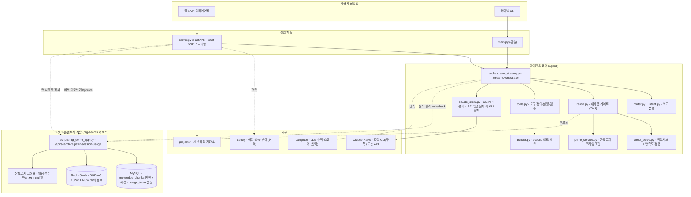
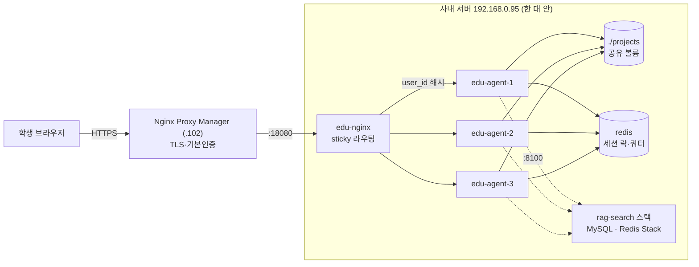
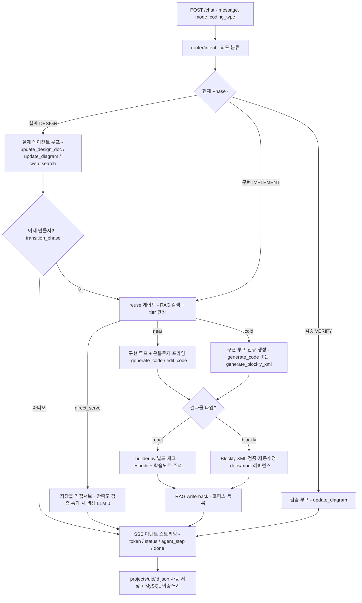

# 교육용 바이브코딩 에이전트 (edu-agent)

만들고 싶은 것을 **한국어로 말하면**, AI 에이전트가 함께 **설계**하고
**코드(웹·앱)** 또는 **LUXROBO MODI 하드웨어 블록**까지 만들어 주는 교육용 도구입니다.
"바이브코딩"을 배우는 학습자가, 코드를 몰라도 자기 아이디어를 실제로 굴려볼 수 있게 돕습니다.

## MODI Planet 3.0 P1

로컬 첫 화면(`/`)은 빈 채팅 대신 두 제품 모드로 시작합니다.

- **교육과정으로 배우기 (Learn)**: 초·중·고 각 9차시, 총 27차시·513페이지의 완성형 수업입니다. 모든 차시에 교과 연계 목표, 핵심 어휘, 작동 예시, 단계별 제작, 오류 해결, 수준별 과제, 평가 문항, 교사 노트와 루브릭이 들어 있습니다.
- **자유롭게 만들기 (Create)**: Web(`react`) / MODI(`blockly`) / Web+MODI(`hybrid`)를 고른 뒤 기존 `design → implement → verify` 생성 엔진으로 이어집니다.

사용자 화면에는 guided Create만 노출합니다. 기존 `quick` 경로는 구형 API 호환을 위해 내부에 남아 있지만 MODI Planet 3.0 UI에서는 선택할 수 없습니다.

## 이 문서를 읽는 법

역할별로 **필요한 곳만** 읽으면 됩니다.

| 나는… | 이것부터 |
|---|---|
| 이 도구가 뭔지 알고 싶다 | [이게 뭔가요?](#이게-뭔가요) → [핵심 개념](#핵심-개념) |
| 클라이언트에서 API를 붙인다 | [API 엔드포인트 요약](#api-엔드포인트-요약) → [외부에서 API 호출](#외부에서-api-호출) |
| 로컬에서 돌려보고 싶다 | [설치 / 실행](#설치--실행) |
| **서버를 배포·운영한다** | [운영 가이드](#운영-가이드-배포환경변수장애-대응) ← API 키 넣는 곳·배포 경로·장애 대응 전부 여기 |
| **비용을 정산해야 한다** | [사용량·비용 리포트](#사용량비용-리포트-usage_reportpy) |
| 내부 동작이 궁금하다 | [전체 아키텍처](#전체-아키텍처) → [에이전트 처리 프로세스 흐름도](#에이전트-처리-프로세스-흐름도) → [설계 문서](#설계-문서) |

## 이게 뭔가요?

- 학습자가 "배달 앱 만들고 싶어" 처럼 말하면, 에이전트가 되묻고 정리하며 **설계도**를 같이 그립니다.
- 충분히 이야기가 되면 에이전트가 **코드를 생성**하고, 그 결과를 미리보기로 보여줍니다.
- 생성된 코드는 esbuild로 **빌드가 되는지 자동 점검**하고, 학습자를 위해 **학습 노트·코드 설명**도 붙여 줍니다.
- 매 빌드 결과는 **RAG 코퍼스에 자동 등록(write-back)** 되어, 비슷한 요청이 다시 오면
  **저장물을 그대로 서브(직접서브)하거나 생성 컨텍스트로 재사용**합니다 — 시간이 갈수록 빨라지고 싸지는 폐루프.
- 세 가지 결과물 타입을 지원합니다.
  - **react**: 웹/앱 화면 코드(JSX)
  - **blockly**: LUXROBO **MODI** 하드웨어용 블록(Blockly XML) — 모터·LED·센서 등
  - **hybrid**: 웹 화면과 MODI 하드웨어가 함께 동작하는 결과물

## 핵심 개념

- **제품 모드**: `learn`(교육과정) / `create`(자유 제작)
- **엔진 모드 (`mode`)**: Create는 `design`을 사용합니다. `quick`은 기존 API 호환용입니다.
- **타입 (`coding_type`)**: `react`(웹·앱) / `blockly`(MODI 하드웨어) / `hybrid`(Web+MODI)
- **3단계 (Phase)**: `설계(DESIGN)` → `구현(IMPLEMENT)` → `검증(VERIFY)`
- **세션 (`session_id`)**: 대화 단위. 인메모리(TTL/LRU) + `projects/<user_id>/<session_id>.json` 파일로 저장·복원.
  프록시 모드(`RAG_UPSTREAM`)에선 **MySQL 원천에 이중쓰기**되어 파일이 유실돼도 복원(hydrate)됩니다.
- **재사용 티어 (`reuse_tier`)**: 코드 생성 요청마다 RAG 게이트가 `direct_serve`(저장물 그대로, 생성 LLM 0) /
  `near`(온톨로지 프라임 + 생성) / `cold`(신규 생성) 중 하나로 라우팅합니다.

## 전체 아키텍처

아키텍처를 두 장으로 나눠 봅니다. **①은 요청 하나가 어떻게 처리되는가**(코드 구조),
**②는 그 코드가 서버에 어떻게 배치돼 있는가**(배포 구조)입니다. 개발할 때는 ①만,
운영·장애 대응할 때는 ②를 보면 됩니다.

### ① 요청이 흐르는 길 — 코드 구조



### ② 서버에 어떻게 배치돼 있나 — 배포 구조 (이중화)

앱 컨테이너는 **3대(레플리카)** 로 뜹니다. 한 대가 죽어도 나머지 두 대가 받고,
죽은 대는 Docker가 자동으로 되살립니다.



**왜 이렇게 생겼나 — 설계 의도 4가지**

| 장치 | 무엇을 막나 | 어떻게 |
|---|---|---|
| **레플리카 3대** | 한 대가 죽으면 서비스 전체 중단 | `edu-nginx`가 죽은 대를 빼고 남은 대로 보냄 (`max_fails=3 fail_timeout=10s`) |
| **sticky 라우팅** | 같은 학생 요청이 매번 다른 대로 흩어져 세션이 튐 | `user_id` consistent hash — 같은 학생은 늘 같은 레플리카로 |
| **공유 볼륨 `./projects`** | 대가 바뀌거나 재시작하면 대화가 사라짐 | 3대가 같은 파일을 보고, mtime 비교로 "남이 더 최신을 썼으면 재로딩" |
| **`restart: unless-stopped`** | 죽은 채로 방치 | Docker가 자동 재기동 (실측: 강제 종료 → 자동 복구 확인) |

> **⚠️ 레플리카는 반드시 같은 박스에 둬야 합니다.** 세션 연속성이 *공유 볼륨 + 파일 mtime 비교*
> 전제 위에 서 있습니다. 다른 서버로 흩으면 이 전제가 깨져 옛 세션을 읽습니다.

> **⚠️ 레플리카를 늘려도 LLM 처리량은 안 늘어납니다.** CLI 모드는 전 사용자가 구독 1계정을
> 공유하므로 계정이 소진되면 몇 대든 같이 막힙니다. 레플리카는 **가용성** 장치이고,
> **처리량**을 늘리는 건 API 모드 전환입니다 → [LLM 모드](#llm-모드--cli구독-vs-api)

## RAG + 온톨로지 기반 재사용 (EDU-27)

같은 파이프라인이 **정확성(생성 컨텍스트 보강)** 과 **비용(재생성 회피)** 두 마리를 잡습니다.
설계 근거: [`docs/design/langfuse-rag-architecture.md`](docs/design/langfuse-rag-architecture.md),
[`docs/design/rag-db-schema.md`](docs/design/rag-db-schema.md),
[`docs/design/progress-report-cost-rag-2026-07.md`](docs/design/progress-report-cost-rag-2026-07.md)

```
사용자 요청 → intent 분류 → reuse 게이트(rag-search 프록시)
                                │
   MySQL(원천 knowledge_chunks) + Redis Stack(BGE-m3 1024d HNSW)
   + concept centroid 재랭킹 + 온톨로지 그래프(선수학습→관련→MODI)
                                │
        ┌── tier 판정 ──────────┴──────────────┐
   direct_serve            near              cold
   (저장물 그대로 반환,   (후보 프라임 +      (신규 생성)
    생성 LLM = 0)          자유 generate)
                                │
   빌드 결과(학습노트·설계·코드·MODI키) → /api/writeback → 검색 인덱스 되먹임 (폐루프)
```

### 3-tier 재사용 라우팅 (이슈 #84)

| Tier | 조건 | 생성 비용 | 구현 |
|---|---|---|---|
| **direct_serve** | 유사도 ≥ `TAU_REUSE` + Haiku 만족도 검증 score ≥ `DIRECT_SERVE_MIN_SCORE`(90) AND 델타 없음 | **0** (검증 ~1k 입력토큰만) | `agent/direct_serve.py` (기본 ON, 킬스위치 有) |
| **near** | 후보는 있으나 직접서브 불가 | 온톨로지 프라임 + 자유 generate (cold 대비 출력 ~19% 절감) | `agent/reuse.py` + `agent/prime_service.py` |
| **cold** | 후보 없음 | 신규 generate | — |

- **온톨로지 프라임**: 개념 → 선수학습 경로 → MODI 모듈 → 학습노트 카드를 생성 컨텍스트에 주입해 정확성을 보강합니다.
- **직접서브 만족도 검증**: 유사도만으로는 "빨간색으로 바꿔줘" 같은 델타를 못 가르므로,
  서브 전에 Haiku 검증 1회를 거칩니다(검증비 ≪ 생성비라 accept 시 순이득). 문서 복원(`docs_restored`)까지 동봉.
- **write-back 폐루프**: 매 빌드 결과가 `concept_key/domain/difficulty/intent/modi_keys` 필드를 가진
  청크로 등록되어 적중률이 누적 상승. 기존 세션 165건 백필 완료.
- **벡터 게이트 승격**: combined 점수 인플레를 우회하는 vec 성분 승격(`TAU_REUSE_VEC`, 기본 0.58).

### 시뮬레이터 · 측정 (LLM 비용 0)

| 도구 | 용도 |
|---|---|
| `POST /api/simulate` + `GET /simulate` | /chat의 온톨로지 RAG 분기·프라임을 LLM 없이 그대로 재현(비용 0). 정적 테스트 페이지 포함 |
| `scripts/simulate_batch.py` | 정확성(PASS/FAIL)·지연·reuse 결정 분포·커버리지 배치 측정 |
| `scripts/lf_cohort.py` | Langfuse에서 티어별 비용·지연·토큰·직접서브 만족도 밴드 코호트 리포트 (`--days 14 --limit 5000` 권장) |
| `scripts/usage_report.py` | **사용량·비용 리포트** — MySQL `usage_turns` 집계로 "오늘 얼마 나왔나" 산출 (`--start` · `--budget-usd` · `--user-id`) |
| Langfuse 스코어 | 매 코드턴 `reuse_tier`·`direct_served`·`direct_serve_score`·near-miss(top1/cand_score)·출력 구성 분해 발행 |

### 운영 상태 점검 (Health Check)

배포된 파이프라인(저장 → 임베딩 → 색인 → 검색 → 게이트)이 정상인지 LLM 없이 확인하는 명령들.

```bash
# 1) 코퍼스 상태 — backend 가 mysql_redis 로 보여야 정상(local 이면 프록시 배선 문제)
curl -s localhost:18080/api/registry/stats        # 앱 프록시
curl -s localhost:8100/api/registry/stats         # rag-search 직접

# 2) 재사용 게이트 시뮬 — 정확성·지연·reuse 분포 + 온톨로지 커버리지 갭 (비용 0)
python scripts/simulate_batch.py http://localhost:18080

# 3) 데이터 충분성 — 표준 질의묶음 판정 분포
curl -s "localhost:8100/api/coverage?coding_type=blockly" | python3 -m json.tool

# 4) 단건 게이트 트레이스 — top1 유사도 vs TAU 로 reuse/review/register 분기
curl -s "localhost:8100/api/search?q=버튼 누르면 LED 켜기&top=3"
```

원천(MySQL) · 색인(Redis) 무결성은 rag-search 컨테이너 안에서 직접 대조한다:

```bash
sudo docker exec -i -w /app/scripts edu-agent-rag-onprem python - <<'PY'
import store_mysql as M, vector_redis as V
with M.connect() as c, c.cursor() as cur:
    cur.execute("SELECT source,COUNT(*) n,SUM(embedding IS NOT NULL) emb "
                "FROM knowledge_chunks GROUP BY source")
    for r in cur.fetchall(): print(r["source"], r["n"], "emb:", r["emb"])
    cur.execute("SELECT COUNT(*) n FROM knowledge_chunks k "
                "LEFT JOIN sessions s ON k.session_id=s.session_id WHERE s.session_id IS NULL")
    print("고아 청크(FK):", cur.fetchone()["n"])
info = V.client().ft(V.INDEX).info()
print("Redis num_docs:", info["num_docs"], "index failures:", info.get("hash_indexing_failures"))
PY
```

**정상 기준 / 실측 스냅샷 (2026-07-10, `.95` 실서비스 전):**

| 점검 항목 | 정상 기준 | 실측 |
|---|---|---|
| `registry/stats` backend | `mysql_redis` (앱·rag 동일) | ✅ mysql_redis, count 3071 |
| MySQL registered / base | 임베딩 100% | ✅ 3069 / 821, emb 100% |
| 코드 자산(source=registered, code) | > 0 | ✅ 253 |
| 고아 청크(FK) · Redis 색인 실패 | 0 / 0 | ✅ 0 / 0 |
| 시뮬 정확성(라우팅·프라임) · 지연 | FAIL/ERROR 0, p90 < ~300ms | ✅ FAIL 0, p90 ~230ms (22 시나리오) |
| reuse_rate(표준 질의) | 참고값 | 60% (중간 — 코퍼스/TAU 캘리브레이션 여지) |

> **`WARN`(온톨로지 그래프 빔)은 오류가 아니다.** `simulate_batch.py` 마지막의 **온톨로지 커버리지** 블록은 신규구현 턴 중 개념매핑이 빈 발화를 **보강 후보 리스트**로 뽑는다(실트래픽 없이 커버리지 프론티어 측정). WARN 은 그 프로브가 "아직 온톨로지가 못 덮는 표현"임을 알리는 신호이지 파이프라인 결함이 아니다. 결함은 `FAIL`/`ERROR`(라우팅 오분기·프라임 미주입·호출 실패)로만 잡힌다.

> **비용절감 "%"는 이 점검으로 나오지 않는다.** 시뮬레이터는 게이트가 발동하는지(메커니즘)와 잠재력(reuse-eligible 비율)까지만 검증한다. 실제 절감률은 **실유저 재사용 트래픽이 쌓인 뒤** `scripts/lf_cohort.py`(Langfuse 코호트)로 티어별 토큰·비용을 대조해 산출한다. `dec=none` 은 재사용할 기존 산출물이 없는 콜드 첫 빌드 턴(게이트 비적용)을 뜻하므로 코드턴 재사용률 분모에서 제외된다.

### 실 비용절감 측정 — 코호트 리포트 (`lf_cohort.py`)

시뮬레이터가 "메커니즘·잠재력"까지라면, **실제 절감률·만족도는 이 리포트로만** 나온다. Langfuse에 쌓인 실유저 트레이스를 티어(direct_serve / near / cold)별로 묶어 비용·지연·토큰을 대조한다.

**실행** — env 3종이 필요하다. 배포 스택은 표준 Langfuse SDK 변수 `LANGFUSE_HOST`를 쓰며, 스크립트는 `LANGFUSE_BASE_URL`이 없으면 `LANGFUSE_HOST`로 폴백한다(PR #125). 그래서 배포 env를 그대로 소싱하면 된다:

```bash
# 배포 env(LANGFUSE_HOST/키)를 그대로 로드해 실행 — 별도 export 불필요
set -a; . /opt/docker/infra/edu-agent/deploy/onprem.env; set +a
python3 scripts/lf_cohort.py --days 14 --limit 5000          # 마크다운 리포트
python3 scripts/lf_cohort.py --days 14 --json cohort.json    # JSON 동시 저장
# 합성/시뮬레이터 트래픽 포함해서 보려면(기본은 제외):
python3 scripts/lf_cohort.py --days 14 --include-synthetic
```

**리포트 읽는 법**

| 블록 | 무엇을 보나 |
|---|---|
| **티어별** (direct_serve/near/cold) | 각 티어 `cost_avg`·`gen_tokens_avg` 대조 = **재사용이 콜드 대비 얼마나 아끼는가**. cold 대비 direct_serve/near의 토큰·비용 낙폭이 곧 절감률. |
| **vec 승격별** | 벡터 유사도로 승격된 턴(`true`)의 비용 프로파일 — TAU 캘리브레이션 근거. |
| **문서복원** | 직접서브 턴이 원 산출물을 온전히 복원했는지(served vs restored). |
| **만족도 히스토그램** | `0-59 / 60-84 / 85-89 / 90-100` 분포. 임계 근처(85~89) 밴드가 하향 후보. |
| **85~89 거절 상세** | 각 건의 `query` vs `source_title`를 사람이 대조해 "그대로 서브해도 만족했을지" 판정 → 이슈 #94 절차. |

**⚠️ 데이터 게이트** — 실트래픽이 얇으면 통계가 안 된다. 판단 전에 표본 수(n)를 먼저 확인한다:

- **비용절감 %**: 티어별 n이 각각 두 자릿수는 돼야 대조가 유의미. 그전엔 "메커니즘 작동 확인"까지만.
- **TAU 캘리브레이션**(`TAU_REUSE`/`TAU_REUSE_VEC`): vec 승격 턴의 유사도 분포가 필요 → 승격 n이 쌓인 뒤에만.
- **직접서브 임계 하향**(이슈 #94, `DIRECT_SERVE_MIN_SCORE`): `band_85_89` **n≥10** 전에는 착수 금지, 리포트만 재실행해 기록.

> **실측 스냅샷 (2026-07-10, `.95` 실서비스 전):** 최근 2일 500 트레이스 기준 `band_85_89 n=1`, 티어 표본 direct_serve 1 / near 2 / cold 3, vec 승격 0건 — **세 판단 모두 데이터 게이트 미달**로 보류. 실트래픽 1~2주 축적 후 위 명령으로 재측정한다.

### 사용량·비용 리포트 (`usage_report.py`)

코호트 리포트가 "재사용이 얼마나 아끼나"를 본다면, 이 리포트는 **"오늘 얼마 나왔나"**를 답합니다.
수업 하루가 끝난 뒤 청구 근거를 뽑는 용도입니다.

#### 어떻게 보나 — 웹 페이지가 가장 편합니다

**링크 하나로 엽니다.** 열 때마다 그 자리에서 집계하므로 항상 최신입니다.

```
https://ai.modiplanet.com/agent/report?token=<REPORT_TOKEN>
```

| 파라미터 | 뜻 | 예 |
|---|---|---|
| `token` | **필수.** 없거나 틀리면 404 | `?token=abc123` |
| `start` · `end` | 기간 (YYYY-MM-DD, KST). 비우면 오늘 | `&start=2026-08-22` |
| `budget_usd` | 예산 대비 소진율 막대 표시 | `&budget_usd=100` |
| `user_id` | 한 학생만 | `&user_id=<uuid>` |
| `limit_users` | 사용자 표 인원수 (기본 30) | `&limit_users=50` |

페이지 안의 조회 폼으로 날짜·예산을 바꿔 볼 수 있고, 아래쪽에 **밤 스냅샷 보관본** 링크가 붙습니다.
원본 JSON이 필요하면 같은 토큰으로 `GET /agent/api/usage/report`를 부르면 됩니다
(`X-Report-Token` 헤더로도 받습니다 — URL에 토큰을 남기기 싫은 자동화용).

#### 수업 중에 보는 화면 — `/report/live`

```
https://ai.modiplanet.com/agent/report/live?token=<REPORT_TOKEN>
```

10초마다 자동 갱신되고 **최근 15분**만 봅니다. 사후 리포트로는 수업 중에 대응할 수 없어서
따로 있습니다 — 지금 붐비는지, 지금 튕기고 있는지를 보고 쉬는 시간을 넣거나 진행 순서를 바꿉니다.

| 파라미터 | 뜻 | 기본 |
|---|---|---|
| `minutes` | 되돌아볼 창 (1~240) | 15 |
| `refresh` | 갱신 주기 초 (5~120) | 10 |

수업 하루 전체를 매번 집계하면 갱신마다 무거워지고, 수업 중에 알고 싶은 건 '오늘 평균'이 아니라
'지금'이라 창을 짧게 잡습니다.

#### 부하는 무엇으로 판단하나

리포트의 앞부분이 "얼마 썼나"라면, **부하 블록**은 "얼마나 버텼나"를 답합니다.

| 지표 | 왜 이걸 보나 |
|---|---|
| **첫 글자까지 (TTFT) p95** | 학생 체감을 지배합니다. 총 소요가 90초여도 3초에 글자가 시작되면 기다리지만, 20초 동안 화면이 비어 있으면 새로고침합니다 — 그 새로고침이 `session_busy`를 만들어 부하를 더 키웁니다 |
| **동시 접속 대비 응답시간** | "40명이 버티나"의 직접적인 답. 전체 p95 하나로는 '원래 느린 것'과 '붐빌 때만 느린 것'이 안 갈립니다. p95가 꺾이는 구간이 수용 한계입니다 |
| **튕김 (`session_busy`)** | 몇 명이 못 들어왔나. 이건 `usage_turns`에 안 남습니다(락을 잡기 전에 거절) — `ops_events`에만 있습니다 |
| **중단(aborted)** | 끝까지 안 간 턴. 실패와 원인이 달라 갈라 봐야 합니다 |
| **서버(레플리카)별** | 한 대만 나쁘면 그 컨테이너 문제, 셋 다 나쁘면 용량 문제 |

**평균을 쓰지 않습니다.** 35명이 3초, 5명이 120초면 평균은 17초라 "괜찮네"로 읽히지만
실제로는 8명 중 1명이 2분을 기다린 것이고, 그 5명이 수업을 포기합니다.

#### ⚠ 부하 도구를 쓸 때 — HTTP 200을 성공으로 세면 안 됩니다

거절 3종(`session_busy`·쿼터·차단)은 **HTTP 200 + SSE 본문**으로 나갑니다. 상태코드로만
집계하면 **실패율이 0%로 보입니다.** SSE 본문의 `{"type":"error","code":...}`를 파싱하세요.
`SSE_ERROR_AS_TOKEN=true`(기본)면 그 앞에 같은 문구가 `type:"token"`으로 한 번 더 나갑니다.

#### 기록이 새고 있는지 확인 — `/health`

```json
{"status":"ok","replica":"edu-agent-1",
 "writeback":{"queued":0,"dropped":0,"failed":0,"last_error":"","worker_alive":true}}
```

`dropped`가 오르면 **큐가 넘쳐 기록이 버려진 것**입니다 — 리포트가 과소집계됩니다.

`failed`는 다릅니다. **전송 실패가 곧 유실은 아닙니다.** 2026-08-21 동시 15건 실측에서
`failed=12`가 찍혔지만 DB에는 15건이 전부 들어가 있었습니다 — rag-search가 같은 순간
임베딩 작업을 처리하느라 응답이 늦었을 뿐, 삽입 자체는 끝났던 것입니다. 그래서
**여기에 재시도를 넣으면 안 됩니다**(중복 행이 쌓입니다). 대신 타임아웃을 넉넉히
잡습니다(`WRITEBACK_TIMEOUT_SECONDS`, 기본 30초) — 워커가 요청 스레드 밖에서 돌아
오래 기다려도 `/chat`에 영향이 없습니다.

유실 여부를 확실히 보려면 `dropped`와 리포트의 턴 수를 대조하세요.

기록은 요청 스레드를 막지 않는 단일 백그라운드 워커가 보냅니다. 예전엔 `/chat`의 `finally`에서
동기 HTTP(타임아웃 2초)로 보냈는데, 부하가 걸리면 정확히 반대로 작동했습니다 — MySQL이
느려질수록 `finally`가 길어지고 그동안 **세션 락이 잡혀 있어** 다음 요청이 튕겼습니다.

#### 시간대 규약 — 저장은 UTC, 표시는 KST

`usage_turns.ts` / `started_at` / `ops_events.ts` / `sessions.created_at` 은 전부 **UTC**입니다.
화면·API 응답의 시각은 조회할 때 KST로 되돌립니다(`CONVERT_TZ`).

> **왜 앱이 UTC로 확정해 보내나 (2026-08-21 실측):**
> 같은 형식(tz-aware ISO `+09:00`)으로 보낸 두 컬럼이 서로 다르게 저장됐습니다 —
> `ts`는 UTC로 변환되고 `started_at`은 KST 그대로 들어갔습니다. 시작이 종료보다
> 9시간 뒤가 되어 **동접 계산이 통째로 0**이 됐고, 곡선이 비어도 예외가 안 나서
> "한산했다"로 오독될 뻔했습니다. MySQL의 암묵적 오프셋 해석에 기대는 한 막을 수
> 없어, 앱이 오프셋 없는 UTC로 확정해 보냅니다(`server._utc_stamp`).

#### 원장에 무엇이 남나

| 테이블 | 무엇 | 왜 갈라 두나 |
|---|---|---|
| `usage_turns` | 턴당 1행 — 토큰·비용·`llm_mode`·`reuse_tier` + 응답시간·TTFT·상태·레플리카·질문유형·결과물·재사용점수 | 분석 원천(영구). Redis 쿼터 카운터(집행, 48h)와 분리 |
| `ops_events` | **턴이 안 만들어지는 사건** — 거절·차단·에러·재시작 | `session_busy`·쿼터는 락을 잡기 **전에** return해서 `usage_turns`의 `finally`에 도달하지 못합니다. 40명 수업에서 가장 중요한 "몇 명이 튕겼나"가 여기에만 있습니다 |
| `usage_reports` | 밤에 굳힌 일별 확정본 | 열 때마다 재계산하면 청구 근거가 못 됩니다 |

질문 유형(`intent`)은 이미 매 턴 `_classify_turn_intent`가 계산하던 값을 저장만 한 것이라
분류기 추가 비용이 0입니다. 결과물(`outcome`)은 턴 전후의 산출물 크기 차이로 판정합니다 —
현재 상태만 보면 한 번 코드가 생긴 뒤의 잡담 턴까지 "코드 턴"으로 집계돼 유형별 단가가 무너집니다.


**토큰 설정** — 서버 `.env`에 넣습니다.

```bash
cd /opt/docker/infra/edu-agent
echo "REPORT_TOKEN=$(openssl rand -hex 16)" | sudo tee -a .env
for r in edu-agent-1 edu-agent-2 edu-agent-3; do
  sudo docker compose up -d --no-build --force-recreate "$r"; done
```

> **⚠️ `REPORT_TOKEN`이 없으면 페이지가 404입니다 — 이게 기본값입니다.**
> 학생이 쓰는 것과 같은 도메인이고 내용은 사용자별 비용이라, "설정을 깜빡해서 공개"가
> 기본이 되면 안 되기 때문입니다. 토큰이 틀려도 403이 아니라 **404**를 줍니다
> (403은 "여기 뭔가 있다"를 알려 주므로).
>
> 토큰은 URL에 실려 접속 로그·브라우저 히스토리에 남습니다. 운영 비밀이 아니라
> **"링크를 아는 사람만"** 수준의 장치로 취급하고, 유출이 의심되면 값을 갈아 끼우세요.

#### 화면에서 볼 수 있는 것

| 블록 | 무엇을 답하나 |
|---|---|
| **총액 + 요약** | 이 기간 얼마 나왔나. 턴·사용자·세션·프로젝트 수 |
| **일자별 추이 그래프** | 막대는 그날 비용, 선은 7일 이동평균. 요철이 아니라 선의 기울기가 추세 |
| **비용 예측** | 최근 실적으로 다음 30일을 **범위**로. 회귀선이 아니라 평균·최소·최대 — 수업은 일정에 몰려서 매끈한 추세선은 거짓 정밀도를 준다 |
| **AI 분석** | "왜 그런가". 여러 표를 겹쳐야 보이는 것들 + 다음 비용 예상 + 줄이는 법 |
| **실제 과금 구분** | 환산액을 **실청구(API)** 와 구독(실청구 0)으로 분리 |
| **재사용 절감 효과** | RAG·직접서브로 API를 안 부른 만큼 |
| **일자별 상세** | 하루 한 줄, 전체 지표. 날짜를 누르면 그날 상세로 |
| **토큰 구성** | 어디에 돈이 쓰였나(가중치 반영 = 실제 기여도) |
| **사용자 패턴** | "얼마"가 아니라 "어떻게 쓰는가" |
| **프로젝트** | 만들어진 결과물 수·타입·목록(제목을 누르면 원본) |

#### 실제 과금은 어떻게 구분하나

가중토큰 환산액은 **"API로 돌렸으면 얼마"** 입니다. 실제로는 두 갈래가 섞입니다.

```
llm_mode='api'              → 진짜 청구된다
llm_mode='cli'              → 구독 정액이라 실청구 0
llm_mode='api_fallback_cli' → API 인증 실패로 구독으로 나감 → 실청구 0
```

날짜 단위 라벨로는 못 가릅니다. 모드를 바꾼 날은 **하루 안에 두 경로가 섞이고**(2026-08-21 실제 발생),
인증 폴백이 걸리면 API 모드로 설정돼 있어도 그 턴은 구독으로 나갑니다. 그래서 `usage_turns`에
**턴마다 실제로 탄 경로**를 남깁니다. 판정이 안 되면 추측하지 않고 `(미상)`으로 둡니다.

#### 재사용 절감은 어떻게 재나

절감은 "안 쓴 돈"이라 직접 관측되지 않습니다. `cold` 턴(재사용 없이 새로 생성)의 평균 단가를
반사실로 놓고 잽니다.

```
saved = Σ_tier  turns_tier × (avg_usd_cold − avg_usd_tier)
```

| 티어 | 뜻 |
|---|---|
| `direct_serve` | 저장물을 그대로 서브 — **생성 LLM 호출 0** |
| `near` | 온톨로지 프라임 + 생성 — 컨텍스트를 줄여서 생성 |
| `cold` | 재사용 후보 없음 — 새로 생성 (**기준선**) |

> **추정치입니다.** 재사용되는 요청이 원래 더 쉬운 요청일 수 있으므로 상한에 가깝게 읽는 편이
> 안전합니다. 그래서 화면에 기준선(cold 턴당 단가)을 함께 띄웁니다.
> cold 턴이 없으면 기준선이 없으므로 0이 아니라 **"미상"** 으로 둡니다.

#### 확정본은 DB에 굳힌다

라이브 조회는 열 때마다 `usage_turns`를 재집계합니다. "지금 얼마"에는 맞지만 **청구 근거로는
약합니다** — 원본이 정리되거나 집계 로직이 바뀌면 과거 수치가 조용히 달라집니다.
그래서 매일 **00:10 KST에 전날 확정치**를 `usage_reports` 테이블에 굳힙니다.

```
usage_turns  (턴 원장 — llm_mode·reuse_tier 포함)
    │
    ├─ 라이브 집계 ──→ /reports · /report
    └─ 밤 배치 ─────→ usage_reports (스칼라 + payload JSON + AI 분석)
```

스칼라 컬럼은 목록·추세용, `payload` JSON은 무손실 상세용입니다. 집계 로직이 나중에 바뀌어도
그날 본 화면이 그대로 복원됩니다.

> **파일이 아니라 DB인 이유** — 파일 스냅샷은 배포 rsync(`--delete`)·볼륨 교체·디스크 정리
> 어디서든 조용히 사라집니다. 리포트는 세션·사용량과 같은 급의 운영 데이터입니다.

**시간 규약** — `generated_at_utc`·`insight_at_utc`는 **UTC 저장**, 화면은 전부 **KST 표시**.
서버 로케일이나 컨테이너 TZ가 바뀌어도 저장값이 흔들리지 않게 하기 위함입니다.
`day`는 타임스탬프가 아니라 **KST 영업일 라벨**("8월 22일 수업")이라 변환 대상이 아닙니다.

**크론 설치 (서버에서 1회)**

```bash
cd /opt/docker/infra/edu-agent
sudo cp deploy/cron/edu-agent-report.cron /etc/cron.d/edu-agent-report
sudo chmod 644 /etc/cron.d/edu-agent-report
sudo systemctl restart cron

python3 scripts/report_snapshot.py --day today     # 즉시 한 번 확인
```

**직접 생성**

```bash
python3 scripts/report_snapshot.py                  # 어제(크론과 동일)
python3 scripts/report_snapshot.py --day 2026-08-22 # 특정 날짜
python3 scripts/report_snapshot.py --backfill 30    # 최근 30일 소급
python3 scripts/report_snapshot.py --no-insight     # AI 분석 없이(LLM 비용 0)
```

> **AI 분석 비용** — 하루 1회 자동 + 화면 버튼으로만 생성합니다. 페이지 로드마다 부르면
> 새로고침이 곧 과금이고 여러 명이 열면 그만큼 늘어납니다. 비용을 보는 화면이 스스로
> 비용을 만들면 곤란합니다. 1회당 대략 $0.003~0.01.

#### 명령줄로 보기 — 세 가지 경로

**(A) CLI 스크립트 — 터미널에서 빠르게**

서버에 SSH로 들어가서 실행합니다. 표까지 예쁘게 렌더해 줍니다.

```bash
cd /opt/docker/infra/edu-agent

python3 scripts/usage_report.py                                      # 오늘(KST) 전체
python3 scripts/usage_report.py --start 2026-08-22                   # 특정 날짜
python3 scripts/usage_report.py --start 2026-08-01 --end 2026-08-31  # 기간
python3 scripts/usage_report.py --start 2026-08-22 --budget-usd 100  # 예산 대비 소진율
python3 scripts/usage_report.py --user-id <uuid>                     # 한 학생만
python3 scripts/usage_report.py --limit-users 50                     # 상위 사용자 표 인원수
python3 scripts/usage_report.py --json                               # 원본 JSON(다른 도구로 넘길 때)
```

**(B) HTTP — 대시보드나 스크립트에 물릴 때**

```bash
# 서버 안에서
curl -s "localhost:8100/api/usage/report?start=2026-08-22" | python3 -m json.tool

# 파라미터: start · end (YYYY-MM-DD, KST) · user_id · limit_users · krw_per_usd
```

> **⚠️ 이 엔드포인트는 외부에 열려 있지 않습니다.** `rag-search`(`:8100`)는 컴포즈 내부
> 전용이라 `https://ai.modiplanet.com/api/usage/report`로는 닿지 않습니다(SPA의 `index.html`이
> 대신 200으로 응답하므로 "되는 것처럼" 보일 수 있습니다 — JSON인지 꼭 확인하세요).
> 서버 밖에서 돌리려면 SSH 터널을 뚫고 `--upstream`을 지정합니다:
>
> ```bash
> ssh -L 8100:localhost:8100 walter@192.168.0.95      # 터널
> python3 scripts/usage_report.py --upstream http://localhost:8100 --start 2026-08-22
> ```

**(C) SQL — 리포트가 못 보여주는 걸 직접 캘 때**

```bash
cd /opt/docker/infra/edu-agent
sudo docker compose -f docker-compose.rag-onprem.yml exec -T mysql \
  sh -c 'mysql -uroot -p"$MYSQL_ROOT_PASSWORD" edu_agent -e "SELECT COUNT(*) FROM usage_turns"'
```

> `$MYSQL_ROOT_PASSWORD`를 **작은따옴표 안에** 두는 게 중요합니다. 큰따옴표로 감싸면
> 호스트 셸에서 빈 값으로 확장돼 mysql이 대화형 비밀번호 입력을 요구합니다.

#### 데이터는 어디서 오나

`/chat`이 턴마다 `finally`에서 MySQL `usage_turns`에 이중쓰기합니다(#133).
쿼터 집행(Redis)과 분리된 **append-only 원장**이라 `QUOTA_ENABLED` 여부와 무관하게 쌓입니다.

동작 조건은 두 가지입니다.

1. **`RAG_UPSTREAM`이 설정돼 있어야 합니다** — 앱은 MySQL에 직접 붙지 않고 rag-search를 경유합니다. 미설정이면 사용량을 아예 보내지 않습니다.
2. **`usage_turns` 테이블이 존재해야 합니다** — 배포의 `Apply MySQL schema` 스텝이 매번 멱등하게 보장합니다.

> **과거 사고 (2026-08-21):** `deploy/schema.sql`은 MySQL 이미지의 `docker-entrypoint-initdb.d`
> 로 **최초 컨테이너 기동 시에만** 적용됩니다. 그래서 #133 이후 추가된 `usage_turns`가 운영 DB에
> 영원히 생기지 않았고, 사용량 적재가 fail-open(try/except)으로 **조용히 실패**해 비용 데이터가
> 0건이었습니다. 배포에 스키마 적용 스텝을 넣어 해소했습니다(#182/#183).
> **교훈: 새 테이블을 추가하면 `deploy/schema.sql`에 `CREATE TABLE IF NOT EXISTS`로 넣어야 합니다.**

**막혔을 때 진단 순서**

```bash
# 1) 테이블이 있나 / 데이터가 쌓이나
curl -s "localhost:8100/api/usage/report?start=$(date +%F)" | head -c 200
#    {"ok":true,...}          → 정상
#    {"ok":false,"error":...} → 아래 원인 확인
#    HTML 이 나옴             → :8100 이 아니라 웹앱을 찌른 것

# 2) 앱이 사용량을 보내고 있나 (RAG_UPSTREAM 배선)
sudo docker exec edu-agent-1 printenv RAG_UPSTREAM      # 비어 있으면 적재 안 됨

# 3) 리포트는 되는데 숫자가 0이면 — 정말 트래픽이 없었는지 쿼터로 교차 확인
curl -s "https://ai.modiplanet.com/agent/quota?user_id=<uuid>"
```

**출력 예**

```
총 비용      $33.45   (약 46,830원)
턴 수        1,240회      사용자 40명      세션 152개
턴당 평균    $0.0270    사용자당 평균 31.0턴

예산 $100 대비    33.5%  █████████···················
남은 예산            $66.55

─ 토큰 구성 (가중치 반영 = 실제 비용 기여도)
  출력    ×5.0      86.6%  ████████████████████████····  원시 5,800,000 tok
  캐시쓰기 ×1.25      12.7%  ████························  원시 3,400,000 tok

─ 시간대별 (동시 사용 규모 파악)
  2026-08-22 10:00  턴   540  사용자   40  $  14.60  ████████████████████
```

**리포트 읽는 법**

| 블록 | 무엇을 보나 |
|---|---|
| **총 비용 / 턴당 평균** | 청구 근거. 턴당 단가가 평소와 크게 다르면 후처리(학습노트·분석) 게이팅이 풀렸는지 의심. |
| **예산 대비** (`--budget-usd`) | 남은 예산. ⚠️ Anthropic이 크레딧 잔액 API를 제공하지 않아 **실제 잔액은 Console에서 확인**해야 한다 — 여기 값은 입력한 예산 기준 계산치다. |
| **토큰 구성** | 어디에 돈이 쓰였나. 출력이 지배적인 게 정상(단가 5배). **캐시쓰기 비중이 크고 캐시읽기가 0에 가까우면** 캐시를 쓰고 회수 못 하는 낭비다. |
| **모드·타입별** | `quick`/`design` × `react`/`blockly` 중 어디가 비싼지. |
| **시간대별** | 동시 사용 규모. `사용자` 열이 곧 그 시간대 활성 인원. |
| **사용자별 상위** | 소수가 몰아 쓰는지. 쿼터 상한(`QUOTA_DAILY_MAX_TURNS`) 조정 근거. |

**비용 환산 근거** — `weighted_tokens = input×1 + output×5 + cache_read×0.1 + cache_creation×1.25`.
이 비율이 Haiku 4.5 단가(입력 $1 / 출력 $5 / 캐시읽기 $0.1 / 캐시쓰기 $1.25 per MTok)와
정확히 일치하므로 **`weighted_tokens / 1e6 = USD`**가 성립한다. 모델을 바꾸면 이 등식이
깨지므로 리포트가 `model` 가정을 함께 출력한다.

> **⚠️ CLI 구독 모드면 실제 청구는 0원이다**(구독 정액). 리포트 금액은 "이 사용량을 API
> 과금으로 환산하면"이다. `GET /health`의 `mode`가 `api`인지 `cli`인지 먼저 확인할 것.

> **실측 (2026-08-21, 프로덕션 동접 40 생성턴):** API 모드 턴당 **29,048 가중토큰(=$0.029)**,
> CLI 모드 풀 생성턴은 **128,600(=$0.129)** 이었다. API 모드에서 프롬프트 캐시가 실효해
> 4.4배 저렴하다.

## 에이전트 처리 프로세스 흐름도

`server.py /chat` 요청이 들어온 뒤 `StreamOrchestrator`가 한 턴을 처리하는 흐름입니다.



## 디렉터리 / 모듈 설명

| 경로 | 역할 |
|---|---|
| `server.py` | **웹/API 진입점.** FastAPI 앱. `/chat`(SSE), 세션 저장·복원(MySQL hydrate 포함), 시뮬레이터, RAG 검색/등록 프록시, 추천 템플릿. |
| `main.py` | **터미널 CLI 진입점.** `/diagram` `/phase` `/files` `/reset` `/quit` 명령 지원. |
| `agent/orchestrator_stream.py` | **스트리밍 오케스트레이터.** 한 턴 전체 흐름(라우팅→reuse 게이트→에이전트 루프→검증·후처리→Langfuse 스코어 발행). |
| `agent/reuse.py` | **재사용 게이트.** rag-search 검색 결과로 tier 판정(TAU_REUSE/TAU_REUSE_VEC), 온톨로지 프라임 조회. |
| `agent/direct_serve.py` | **직접서브.** 저장물 후보를 Haiku 만족도 검증(≥90) 후 생성 없이 반환. 문서 복원 동봉. 킬스위치 `DIRECT_SERVE`. |
| `agent/prime_service.py` | **온톨로지 프라임 조립.** 개념→선수학습→MODI→학습노트 카드를 생성 컨텍스트로. `/api/simulate`와 공유. |
| `agent/router.py` / `agent/intent.py` | API 호출 없는 **키워드 기반 의도 분류.** 수정/질문/짧은 승인/명확화 답변 구분. |
| `agent/tools.py` | 에이전트 **도구 정의·실행** + MODI 코어 로딩 + Blockly XML 검증/자동수정. Phase별 허용 도구가 다름. |
| `agent/models.py` / `agent/context.py` | 도메인 모델(`Phase`, `DesignDoc`, `TaskPlan`)과 세션 상태(SessionState). |
| `agent/builder.py` | 생성된 React 코드를 **esbuild로 번들 빌드 체크.** |
| `agent/modi_modules.py` | MODI 하드웨어 **모듈 배치·조립 가이드** 생성(blockly 모드). |
| `agent/claude_client.py` | **LLM 호출 분기.** 로컬 Claude CLI(구독) 또는 Anthropic API. 429/529/타임아웃 지수 백오프(`agent/retry.py`). |
| `agent/concurrency.py` / `agent/session_store.py` | 동일 세션 동시 턴 차단(인메모리/Redis 분산 락) + TTL/LRU 세션 스토어(멀티워커 stale 감지). |
| `agent/observability.py` | **Sentry 연동.** 에러·성능·부하. 세션 한도(429)는 error가 아닌 `load_constraint` warning으로 분류. |
| `agent/guardrails.py` | 입력 가드레일 + Langfuse PII 마스킹. |
| `agent/prompts.py` / `agent/prompt_cache.py` / `agent/llm_config.py` | 단계·모드별 시스템 프롬프트, 프롬프트 캐시 분리, 모델 설정(Haiku 단일). |
| `scripts/rag_demo_app.py` | **rag-search 서비스**(별도 컨테이너). 벡터 검색/등록/커버리지 + 세션 MySQL 원천 API + 사용량 리포트 집계. |
| `scripts/report_html.py` | **리포트 렌더러.** dict → 자체 완결 HTML 한 장(외부 자산 0). 그래프는 인라인 SVG. |
| `scripts/report_insight.py` | **AI 분석.** 집계를 접어 LLM 에 넘기고 "다음 비용 예상"을 받는다. 실패해도 리포트는 그대로. |
| `scripts/report_snapshot.py` | **밤 크론.** 전날 확정치를 DB(`usage_reports`)에 굳힌다. `--day` · `--backfill` · `--no-insight`. |
| `scripts/usage_report.py` | 같은 데이터를 **터미널 표**로. `--start` · `--budget-usd` · `--user-id` · `--upstream`. |
| `scripts/` (기타) | 온톨로지 빌드, BGE 임베딩, 백필, 스키마 적용(`apply_schema.py`), 부하 테스트(`load_test.py`), 시뮬레이션(`sim_chat_flow.py`, `simulate_batch.py`), 코호트 측정(`lf_cohort.py`). |
| `build_template/` | 빌드 체크용 React 템플릿(React 18, react-router, lucide-react, esbuild). |
| `docs/modi/` | MODI 코어 문서와 모듈별 레퍼런스. Blockly 검증의 근거. |
| `docs/design/` | 설계 문서(아래 표 참고). |
| `projects/` | 세션 저장 폴더(`<user_id>/<session_id>.json`). (git에는 올리지 않음) |
| `deploy/cron/` | `/etc/cron.d` 에 넣는 크론 정의. |

## 설치 / 실행

### 요구 사항
- Python **3.11 이상**
- 의존성: `anthropic`, `pydantic`, `fastapi`, `uvicorn`, `langfuse`, `python-dotenv`, `httpx`
- (기본 동작) 로그인된 **Claude CLI** 또는 (`USE_LOCAL_CLAUDE=false`일 때) **Anthropic API 키**
- (선택) RAG 재사용을 쓰려면 **rag-search 서비스**(MySQL + Redis Stack)
  — 운영은 `docker-compose.rag-onprem.yml`, 로컬 단독 실험은 `docker-compose.rag-search.yml`

### 1) 가상환경 + 설치
```bash
python -m venv .venv
source .venv/bin/activate
pip install -e .
```

Windows PowerShell에서는 활성화 명령이 `.\.venv\Scripts\Activate.ps1`입니다. 전체 테스트는 콘솔 인코딩 차이를 피하도록 `$env:PYTHONUTF8='1'; python -m pytest`로 실행합니다.

### 2) 환경변수(.env) — 전체 목록은 `.env.example`
```dotenv
# ── LLM ──
USE_LOCAL_CLAUDE=true            # true=로컬 Claude CLI(구독) / false=API 직접 호출
ANTHROPIC_API_KEY=               # USE_LOCAL_CLAUDE=false 일 때만 필요
ANTHROPIC_MODEL=claude-haiku-4-5-20251001

# ── RAG 재사용 (선택 — 비우면 게이트 미발동, cold 생성만) ──
RAG_UPSTREAM=                    # rag-search 서비스 URL (예: http://rag-search:8100)
DIRECT_SERVE=1                   # 직접서브 킬스위치
DIRECT_SERVE_MIN_SCORE=90        # 만족도 검증 컷오프
# TAU_REUSE / TAU_REUSE_VEC      # 유사도 임계 (기본값 사용 권장 — 코호트 데이터로 튜닝)

# ── 토큰 쿼터 (선택 — QUOTA_ENABLED=false면 완전 no-op) ──
# ⚠ 운영값은 여기가 아니라 deploy/onprem.env 에 있습니다(현재 turns=70 / tokens=5,000,000).
#    턴과 토큰은 **둘 중 하나라도** 소진되면 차단되므로 한쪽만 올리면 다른 쪽이 병목이 됩니다.
QUOTA_ENABLED=false              # true면 일일 쿼터 강제(off여도 GET /quota 는 누적을 보여줌)
QUOTA_SCOPE=user                 # user | session
QUOTA_DAILY_MAX_TURNS=0          # 하루 턴(대화 요청) 상한, 0=무제한
QUOTA_DAILY_WEIGHTED_TOKENS=2000000  # 하루 가중 토큰 상한
SSE_ERROR_AS_TOKEN=true          # 차단 시 안내를 SSE type:token 으로도 병행 전송(무응답 방지, #147)

# ── 사용량 리포트 웹페이지 (선택 — 비우면 /report 가 404, 이게 기본) ──
REPORT_TOKEN=                    # 설정해야 /report·/api/usage/report 가 열립니다

# ── 관측 (선택 — 비우면 비활성) ──
LANGFUSE_SECRET_KEY=
LANGFUSE_PUBLIC_KEY=
LANGFUSE_HOST=
SENTRY_DSN=
SENTRY_ENVIRONMENT=dev           # dev | onprem | release

# ── 런타임 ──
REDIS_URL=                       # 멀티워커/멀티레플리카 분산 세션 락 (docker-compose가 자동 주입)
SESSION_TTL_SECONDS=86400
SESSION_MAX=500
WEB_CONCURRENCY=1                # 레플리카 1개당 uvicorn 워커 수 (compose 가 주입)
API_FALLBACK_COOLDOWN_SECONDS=600  # API 인증 실패 후 CLI 로 내려가 있을 시간
CLAUDE_HOME=/home/walter/.claude       # CLI 구독 인증 마운트 원본 (compose)
CLAUDE_JSON=/home/walter/.claude.json
```

### 3) 실행
**웹/API 서버**
```bash
make run
# = uvicorn server:app --host 0.0.0.0 --port 8000 --reload
```

**터미널 CLI**
```bash
python main.py
```

**테스트 / 시뮬레이션**
```bash
make test        # pytest 전체
make sim         # chat 시뮬레이션 (LLM 사용)
make load-test   # 동시성/부하 검증
```

## 운영 가이드 (배포·환경변수·장애 대응)

> 서버를 만지는 사람을 위한 절이다. 로컬 개발만 한다면 [설치 / 실행](#설치--실행)까지만 보면 된다.

### 어디에 뭐가 있나

| 항목 | 위치 |
|---|---|
| **운영 서버** | `walter@192.168.0.95` (사내망 전용 — 외부에서는 SSH 불가) |
| **배포 디렉터리** | `/opt/docker/infra/edu-agent` |
| **서비스 URL** | `https://ai.modiplanet.com` (앱 경로는 `/agent/*`) |
| **API 키·비밀값** | `/opt/docker/infra/edu-agent/.env` ← **서버에만 존재. git에 없음** |
| **환경 오버레이** | `deploy/onprem.env` (git에 있음 — 관측·쿼터·RAG 배선) |
| **앱 컨테이너** | `edu-agent-1` / `-2` / `-3` (+ 앞단 `edu-nginx`) |
| **RAG 스택** | `docker-compose.rag-onprem.yml` — MySQL + Redis Stack + `rag-search`(`:8100`) |
| **nginx 설정** | `deploy/nginx/edu-agent.conf` (컨테이너에 **디렉터리**로 마운트) |
| **배포 워크플로** | `.github/workflows/deploy.yml` (self-hosted runner가 `.95`에서 실행) |

### 환경변수는 3겹으로 쌓인다

값이 겹치면 **아래쪽이 이깁니다.**

```
  1. .env                       ← 서버에만 있는 비밀값 (API 키, GEMINI 키 등)
        ↓ 덮어씀
  2. deploy/onprem.env          ← git에 있는 환경 오버레이 (Sentry·Langfuse·쿼터·RAG)
        ↓ 덮어씀
  3. docker-compose.yml 의 environment:   ← 배선 고정값 (REDIS_URL, HOME 등)
```

무엇을 어디에 둘지 규칙은 하나입니다.

| 성격 | 어디에 | 왜 |
|---|---|---|
| **비밀값** (API 키, 구독 인증) | `.env` (서버에만) | git에 올라가면 히스토리에서 못 지웁니다 |
| **환경별 설정** (쿼터, 관측 DSN, RAG 주소) | `deploy/*.env` | 배포마다 누락되면 안 되니 코드와 함께 버전 관리 |
| **배선 고정값** (컨테이너 간 주소) | `compose environment:` | 환경과 무관하게 항상 같아야 함 |

배포 시 `rsync`가 `.env`를 **제외**하므로(`deploy.yml`), 서버의 `.env`는 배포해도 덮어써지지 않습니다.

> **⚠️ `compose`의 `environment:`는 `env_file`을 이깁니다.** 예전에 여기에
> `USE_LOCAL_CLAUDE: "true"`를 하드코딩해서, 서버 `.env`에 `false`를 넣어도 API 모드로
> 안 바뀌었습니다. 지금은 `"${USE_LOCAL_CLAUDE:-true}"`라 `.env`로 덮어쓸 수 있습니다.
> **새 변수를 `environment:`에 넣을 때는 이 함정을 먼저 확인하세요.**

### LLM 모드 — CLI(구독) vs API

| | **CLI 모드** (`USE_LOCAL_CLAUDE=true`, 기본) | **API 모드** (`false`) |
|---|---|---|
| 인증 | 호스트 `~/.claude` 마운트 (구독 로그인) | `ANTHROPIC_API_KEY` |
| 과금 | 구독 정액 (**실청구 0원**) | 종량제 |
| 동시성 | 전 사용자가 **구독 1계정 공유** → 소진되면 전원 차단 | 계정 한도와 무관 |
| 프롬프트 캐시 | 무시됨 | 실효 |
| 프로세스 | LLM 호출마다 node 서브프로세스 | HTTP만 |
| 실측 (생성 턴 1회) | 128,600 가중토큰 · ~30초 | **29,048 가중토큰 · ~4초** |

**동접 40 실측(2026-08-21)**: CLI 모드는 성공률 0%(전부 절단), 16코어 load 161까지 올라
SSH조차 막혔습니다. API 모드 + 3레플리카로 **성공률 100% · p50 72초**가 됐습니다.

#### API 키를 넣는 곳

**`.env`에만 넣습니다. 절대 커밋하지 마세요.**

```bash
ssh walter@192.168.0.95
cd /opt/docker/infra/edu-agent

sudo tee -a .env >/dev/null <<'EOF'
USE_LOCAL_CLAUDE=false
ANTHROPIC_API_KEY=sk-ant-api03-...
EOF

# 3대 순차 반영 (진행 중 대화를 드레인하며 교체)
for r in edu-agent-1 edu-agent-2 edu-agent-3; do
  sudo docker compose up -d --no-build --force-recreate "$r"
done

# 확인 — mode 가 api 로 바뀌어야 함
curl -s https://ai.modiplanet.com/agent/health
```

> 키는 [console.anthropic.com](https://console.anthropic.com) → **API keys**에서 발급합니다.
> 조직 계정의 크레딧을 쓰려면 그 조직으로 로그인한 상태에서 발급하세요.

**CLI 모드로 되돌리기** — `.env`에서 `USE_LOCAL_CLAUDE=true`로 바꾸고 위 재기동만 하면 됩니다.

#### API가 죽어도 서비스는 안 죽는다 — 자동 폴백

키 만료·크레딧 소진·오타로 API 인증이 실패하면 **자동으로 CLI 경로로 넘어갑니다**(#179).
"키가 잘못돼서 서비스 전체가 멈추는 것"이 가장 위험하기 때문입니다.

```
① 키가 비었거나 공백  → 네트워크 왕복 없이 즉시 CLI
② 호출 중 401/403/크레딧 소진 → 같은 호출을 CLI로 재시도
③ 한 번 실패하면 래치 → 쿨다운(기본 600초) 동안 죽은 API를 두드리지 않음
```

쿨다운이 지나면 API를 다시 시도하므로, **키를 고치면 재배포 없이 돌아옵니다.**
폴백이 걸리면 Sentry에 `load_constraint=api_auth_fallback` 태그로 경보가 갑니다.

> **인증과 무관한 에러(레이트리밋·타임아웃·도구 실패)는 폴백하지 않고 그대로 올립니다.**
> 진짜 버그를 CLI로 숨기면 안 되기 때문입니다.

### 배포하는 법

**자동 (평소)** — `master`에 push하면 끝입니다.

```
CI(lint+test) 통과 → self-hosted runner(.95)가 실행
  ① 소스 rsync (.env·projects 제외)
  ② 이미지 빌드 (구 컨테이너는 계속 서빙)
  ③ 레플리카 1→2→3 순차 교체 (health-gated, 무중단)
  ④ 고아 컨테이너 제거
  ⑤ HA 배선 검증 — nginx upstream이 실제로 3대인지 확인, 아니면 배포 실패
  ⑥ RAG 스택 기동 → MySQL 스키마 적용(멱등) → centroid 백필 → 검색 품질 게이트(gold 8/8)
```

`paths:` 필터가 걸려 있어 문서만 고치면 배포는 돌지 않습니다.
`deploy/*.env`도 트리거 경로에 포함돼 있으므로 **쿼터 값만 바꿔도 배포가 반영됩니다.**

**수동** — GitHub Actions → `Deploy edu-agent` → `Run workflow`

**긴급 롤백 (CLI 모드로 되돌리기)**

```bash
cd /opt/docker/infra/edu-agent
sudo sed -i 's|^USE_LOCAL_CLAUDE=.*|USE_LOCAL_CLAUDE=true|' .env
for r in edu-agent-1 edu-agent-2 edu-agent-3; do
  sudo docker compose up -d --no-build --force-recreate --timeout 10 "$r"
done
```

> `--timeout 10`은 `stop_grace_period 180s`를 무시하고 빨리 교체하기 위한 것입니다.
> 진행 중 대화가 잘릴 수 있으므로 **긴급 상황에서만** 씁니다. 평상시 배포는 3대 × 최대 180초
> = 최대 9분이 걸릴 수 있습니다(진행 중 스트림이 없으면 즉시 끝납니다).

### 장애 대응

**먼저 볼 것**

```bash
curl -s https://ai.modiplanet.com/agent/health          # status·mode·active_sessions
sudo docker ps --filter name=edu-agent- --format '{{.Names}}\t{{.Status}}'
sudo docker logs --tail 50 edu-agent-1 | grep -iE "폴백|fallback|quota|error"
```

**증상별 대응**

| 증상 | 먼저 의심할 것 | 확인 |
|---|---|---|
| 전원이 "사용 한도" 안내를 받음 | CLI 모드 구독 계정 소진 | `/agent/health`의 `mode` → `cli`면 API 모드로 전환 |
| 일부 학생만 차단 | 개인 쿼터 소진 | `GET /agent/quota?user_id=<uuid>` |
| 응답이 아예 없음 | 레플리카 전멸 / nginx 배선 | `docker ps` + `docker exec edu-nginx nginx -T \| grep upstream -A5` |
| 느리지만 동작 | 호스트 부하 | `uptime` (16코어 기준 load 16 이상이면 포화) |
| 대화가 자꾸 초기화 | sticky 깨짐 | 요청에 `user_id`가 실려 오는지 (없으면 IP 폴백이라 잘 흩어짐) |

**HA가 실제로 도는지 검증** (수업 전 점검용)

```bash
# 1) PID 1 이 uvicorn 인가 — sh 면 종료 신호가 앱에 안 닿는다
sudo docker exec edu-agent-2 sh -c 'cat /proc/1/comm'        # → uvicorn

# 2) 죽이면 자동으로 살아나는가
sudo docker inspect edu-agent-2 --format 'before={{.RestartCount}}'
sudo kill -9 $(sudo docker inspect -f '{{.State.Pid}}' edu-agent-2)
sleep 20
sudo docker inspect edu-agent-2 --format 'after={{.RestartCount}} status={{.State.Status}}'
curl -s localhost:18080/health      # 죽는 동안에도 나머지 2대가 받아야 정상
```

> **⚠️ `docker exec ... kill -9 1`은 안 먹습니다.** 리눅스는 같은 PID 네임스페이스 안에서
> 네임스페이스 init(PID 1)에게 보낸 SIGKILL을 커널이 폐기합니다. 반드시 **호스트에서**
> 실제 PID를 죽여야 합니다. (2026-08-21에 이걸 몰라 "재시작이 안 된다"고 잘못 진단했습니다.)

### 알려진 제약

| 항목 | 내용 |
|---|---|
| **레플리카는 같은 박스에** | 세션 연속성이 공유 볼륨 + mtime 비교 전제. 분산하면 stale 세션 |
| **healthcheck는 재시작을 안 시킨다** | Docker healthcheck는 `unhealthy` 표시만 합니다. 프로세스가 살아 있는데 응답만 못 하는 상태는 자동 복구되지 않습니다 |
| **진행 중 턴은 '재개'가 아니라 '보존'** | 산출물 확정 시점에 체크포인트를 남기므로(#181) 결과는 남지만, 죽은 턴이 이어서 실행되지는 않습니다 |
| **크로스 유저 세션 노출** | 세션이 `session_id`만으로 식별됩니다. 같은 `session_id`를 쓰면 남의 대화가 보입니다 — 클라이언트가 `user_id`별로 고유한 `session_id`를 발급해야 합니다 |
| **CLI 모드 공유 쿼터** | 쿼터 상한은 '용량'이 아니라 '공정성' 장치입니다. 구독 계정 자체가 소진되면 상한과 무관하게 전원이 막힙니다 |

## API 엔드포인트 요약

| 메서드 | 경로 | 설명 |
|---|---|---|
| GET | `/` | MODI Planet 3.0 P1 로컬 웹 화면. |
| GET | `/api/v3/home` | Learn/Create 제품 진입 정보. |
| GET | `/api/v3/curriculum` · `/api/v3/curriculum/{grade_band}` | 초·중·고 9차시 선택 셸 데이터(P1 placeholder). |
| POST | `/api/v3/create/sessions` | guided Create 세션 생성. `coding_type=react|blockly|hybrid`. |
| POST | `/api/v3/create/sessions/{id}/chat` | 기존 `/chat` 생성 코어로 위임하는 Create SSE 채팅. 외부에서 `quick`으로 바꿀 수 없습니다. |
| POST | `/chat` | 메시지를 보내고 **SSE 스트리밍**으로 응답 받기 (`session_id`, `message`, `mode`, `coding_type`, `runtime_error`). 오류는 SSE `type:error` 이벤트로 전달(상세: [`docs/api/sse-error-contract.md`](docs/api/sse-error-contract.md)). |
| POST | `/chat/stop` | 진행 중인 응답 중단. |
| GET | `/quota` | 남은 일 쿼터 조회 (`enabled`·`scope`·`limit`·`max_turns`·`turns_remaining`). `QUOTA_ENABLED` off여도 현재 누적 표시. |
| GET | `/health` / `/health/llm` | 라이브니스(토큰 소모 0) / 세션별 LLM 동작 확인(`?ping=1`이면 실제 왕복 1회, TTL 캐시). `/health` 는 응답한 **레플리카 이름**과 **기록 큐 상태**(`queued`/`dropped`/`failed`/`worker_alive`)도 돌려준다 — `dropped`·`failed` 가 오르면 리포트가 과소집계된다. |
| POST | `/api/simulate` | **모드 시뮬레이터.** /chat의 RAG 분기·프라임을 LLM 없이 재현(비용 0). |
| GET | `/simulate` | 시뮬레이터 정적 테스트 페이지. |
| GET | `/session/{id}` | 현재 단계(phase)와 다이어그램 조회. |
| POST | `/session/{id}/reset` · `/save` · `/restore` | 세션 초기화 / 파일 저장(+MySQL 이중쓰기) / 복원(파일 없으면 MySQL hydrate). |
| GET | `/projects` | 저장된 프로젝트 목록 (파일 + MySQL union). |
| GET/DELETE | `/projects/{filename}` | 특정 프로젝트 불러오기 / 삭제. |
| GET | `/reference` | 추천 템플릿 목록. |
| POST | `/reference/{name}/instantiate` | 추천 템플릿을 내 세션으로 복제. |
| GET | `/api/search` · `/api/coverage` · `/api/query` | RAG 하이브리드 검색 / 커버리지 맵 / 온톨로지 질의 (RAG 구성 시). |
| POST | `/api/register` | 결과물을 검색 인덱스에 등록(write-back). |
| GET | `/rag` · `/rag/health` | RAG 데모 페이지 / RAG 헬스 (RAG 구성 시). |
| GET | `/reports` | **기간 리포트 화면**(기본 진입점). 전체 요약 + 그래프 + 예측 + 일자별. `token` 필수(`REPORT_TOKEN`) — 없거나 틀리면 404. `start`·`end`·`preset`(today/7d/30d/month)·`budget_usd`. |
| GET | `/report` | 하루(또는 지정 기간) 상세. 같은 파라미터. |
| GET | `/report/archive/{YYYY-MM-DD}` | DB 에 굳힌 그날 확정본(이후 변하지 않음). |
| GET | `/report/live` | **수업 중에 띄워 두는 실시간 화면.** 최근 15분·10초 자동 갱신 — 지금 동시 접속·첫 글자 대기·튕김. `minutes`(1~240)·`refresh`(5~120). |
| POST | `/report/insight` | AI 분석 (재)생성 — 화면 버튼이 부르는 경로. `day` 필수. **LLM 과금** 발생. |
| GET | `/api/usage/report` | 리포트 원본 JSON. `token` 또는 `X-Report-Token` 헤더. |

**rag-search 전용** (`:8100`, 앱이 MySQL 에 직접 붙지 않으므로 경유)

| 메서드 | 경로 | 설명 |
|---|---|---|
| POST | `/api/usage/add` | 턴 사용량 1건을 MySQL `usage_turns` 에 적재. 토큰·비용에 더해 응답시간·TTFT·상태·레플리카·질문유형·결과물·재사용점수를 함께 받는다. |
| POST | `/api/ops/event` | **턴이 안 만들어지는 사건**을 `ops_events` 에 적재 — 동시처리 거절·쿼터·차단·에러. 거절은 세션 락을 잡기 전에 return 해서 `usage_turns` 에 흔적이 없다. |
| GET | `/api/usage/report` | **사용량·비용 리포트** — 기간 집계(총계/일자별/모드별/사용자별/시간대별) + 실과금 구분 + 재사용 절감 + 사용자 패턴 + 프로젝트. `start`·`end`(YYYY-MM-DD, KST)·`user_id`·`limit_users`. |
| POST | `/api/usage/snapshot` | 하루치를 `usage_reports` 에 굳힌다(멱등). `day`·`llm_mode`·`with_insight`. |
| GET | `/api/usage/snapshot` | 굳혀 둔 확정본(payload + AI 분석). `day`. |
| GET | `/api/usage/snapshots` | 확정본 목록(스칼라). `start`·`end`. |
| POST | `/api/usage/insight` | AI 분석 (재)생성 후 저장. `day`. |
| POST/GET/DELETE | `/api/session/save` · `list` · `get` · `delete` | 세션 원천(MySQL) 읽기·쓰기 — 파일 유실 시 hydrate 경로. |

## 관측 (Langfuse + Sentry)

- **Langfuse** (선택): 모든 LLM 호출 추적 + 매 코드턴 재사용 스코어(`reuse_tier`, `direct_served`,
  `direct_serve_score`, near-miss, 출력 구성 분해) 발행. PII는 소스에서 마스킹.
  코호트 리포트: `python3 scripts/lf_cohort.py --days 14 --limit 5000`
- **Sentry** (선택): 에러·성능·부하 관측. 구독 세션 한도(429)·동시 턴 거절은 error가 아닌
  **`load_constraint` 태그의 warning**으로 분류해 노이즈를 줄입니다. 상세: [`docs/observability-sentry.md`](docs/observability-sentry.md)

## 외부에서 API 호출

사내 서버(`192.168.0.95`)에 Docker로 배포되어 Nginx Proxy Manager(`.102`)를 통해 노출됩니다.
배포·운영 절차는 [운영 가이드](#운영-가이드-배포환경변수장애-대응)를 보세요.

| 용도 | Base URL | 인증 |
|---|---|---|
| **운영 서비스** (수업) | `https://ai.modiplanet.com` — 앱 경로는 `/agent/*` | 없음 (학생이 직접 접속) |
| **API 연동용** | `https://edu-agent.luxrobo.net` | HTTP Basic (NPM Access List) |

- API 연동용 계정은 문서에 저장하지 않습니다. NPM Access List의 별도 비밀값을 사용하세요.
- 두 도메인 모두 같은 백엔드(`.95:18080` → `edu-nginx` → 레플리카 3대)를 봅니다.
- **`ai.modiplanet.com`은 `/agent` 프리픽스를 떼고 앱에 넘깁니다.** 즉 앱이 보는 경로는
  `/health`이고 밖에서 부르는 경로는 `/agent/health`입니다. 앱 코드는 이 프리픽스를 모르므로
  **절대경로 링크를 만들면 프록시 뒤에서 깨집니다** — 상대경로를 쓰세요.

### curl — `/chat`은 SSE 스트리밍이라 `-N`
```bash
curl -N -u '<NPM_BASIC_USER>:<NPM_BASIC_PASSWORD>' https://edu-agent.luxrobo.net/chat \
  -H 'Content-Type: application/json' \
  -d '{"session_id":"s1","message":"LED 깜빡이는 앱 만들어줘","mode":"design","coding_type":"react"}'
```
응답은 `data: {...}` 줄로 계속 내려옵니다(`status`, `token`, 마지막 `done`).

### Python
```python
import requests
r = requests.post(
    "https://edu-agent.luxrobo.net/chat",
    auth=("<NPM_BASIC_USER>", "<NPM_BASIC_PASSWORD>"),
    json={"session_id": "s1", "message": "...", "mode": "design", "coding_type": "react"},
    stream=True,
)
for line in r.iter_lines():
    if line:
        print(line.decode())
```

### JS (서버사이드 / Node)
```js
await fetch("https://edu-agent.luxrobo.net/chat", {
  method: "POST",
  headers: {
    "Authorization": "Basic " + Buffer.from(
      process.env.NPM_BASIC_USER + ":" + process.env.NPM_BASIC_PASSWORD
    ).toString("base64"),
    "Content-Type": "application/json",
  },
  body: JSON.stringify({ session_id: "s1", message: "...", mode: "design", coding_type: "react" }),
});
```

> **브라우저(다른 도메인)에서 직접 호출 시 주의**: `Authorization` 헤더가 붙으면 브라우저가 preflight(OPTIONS)를 먼저 보내는데 NPM 기본인증이 이를 401로 막아 CORS가 깨질 수 있습니다. 서버↔서버(curl/Python/Node)는 정상. 브라우저 프론트에서 직접 부를 경우, NPM Access List에 **호출 출발지 IP를 화이트리스트**(현재 `satisfy_any=true`라 "IP 또는 인증" 중 하나만 충족하면 통과)하거나 OPTIONS 인증 예외를 두세요.

### 배포 방식 (요약)

자세한 절차·롤백·장애 대응은 [운영 가이드](#운영-가이드-배포환경변수장애-대응)에 있습니다.

- **LLM 인증 2가지**: CLI(호스트 `~/.claude` 마운트, 키 불필요) / API(`ANTHROPIC_API_KEY`).
  `.env`의 `USE_LOCAL_CLAUDE` 하나로 전환하며, **API 인증이 실패하면 자동으로 CLI로 폴백**합니다.
- **앱은 3 레플리카**: `edu-agent-1/2/3` + 앞단 `edu-nginx`(user_id sticky). 배포는 1→2→3 순차 교체로 무중단.
- **자동 배포**: `master` push → CI(lint+test) → self-hosted runner(`.95`)가 빌드·롤링 교체·HA 배선 검증·MySQL 스키마 적용·RAG 백필·검색 품질 게이트까지 수행.
- **rag-search 서비스**: 별도 스택(`docker-compose.rag-onprem.yml`: MySQL + Redis Stack + BGE 임베딩). 메인 앱은 `RAG_UPSTREAM`으로 프록시해 경량 유지.
- **프록시 등록**: `make nginx-register` — NPM에 도메인→프록시→Let's Encrypt→기본인증 자동 등록(멱등). 자격증명은 `scripts/npm.env`(git 제외).

## 참고 / 주의

- 코드 기본값은 **로컬 Claude CLI**(구독 인증)이고, **현재 운영 서버는 API 모드**로 돌고 있습니다.
  전환은 `.env`의 `USE_LOCAL_CLAUDE` + `ANTHROPIC_API_KEY` → [API 키를 넣는 곳](#api-키를-넣는-곳)
  - CLI 모드는 `max_tokens`·프롬프트 캐시가 무시되므로, 출력 상한·캐시 절감은 API 모드에서만 실효합니다.
  - API 인증이 실패하면 서비스가 멈추지 않고 **CLI로 자동 폴백**합니다(#179).
- **Langfuse / Sentry / RAG**는 모두 선택입니다. 키·URL이 없으면 해당 기능만 자동 비활성화되고 코어는 정상 동작합니다.
- 재사용 임계(`TAU_REUSE`, `DIRECT_SERVE_MIN_SCORE`)는 보수적으로 설정돼 있으며,
  실트래픽 코호트 데이터(`scripts/lf_cohort.py`)를 근거로만 조정합니다(이슈 #94 절차 참고).

---

## 설계 문서

이 README의 근거가 된 설계·측정 자료입니다. **모든 설명은 실제 코드(파일·라인)로 추적해 확정한 사실**만 담았습니다.

| 자료 | 설명 |
|---|---|
| [`docs/design/ha-and-cost-reporting.md`](docs/design/ha-and-cost-reporting.md) | **이중화·LLM 모드 전환·비용 리포트 (2026-08-21).** 동접 40 실측(0%→100%), 배포·런타임 함정 5가지, 남은 위험. 운영자 필독. |
| [`docs/design/progress-report-cost-rag-2026-07.md`](docs/design/progress-report-cost-rag-2026-07.md) | **비용·RAG·온톨로지 진행 보고서 + 로드맵(P0~P3).** 시스템 현황 한눈에 보기 좋음. |
| [`docs/design/langfuse-rag-architecture.md`](docs/design/langfuse-rag-architecture.md) | Langfuse 데이터 체계화 & RAG 재사용 5계층 아키텍처 설계. |
| [`docs/design/rag-db-schema.md`](docs/design/rag-db-schema.md) | RAG DB 스키마(MySQL 원천 + Redis 벡터), 온톨로지 그래프, 검색·조립 전략. |
| [`docs/design/chat-mysql-session-store.md`](docs/design/chat-mysql-session-store.md) | /chat ↔ 온톨로지 프라임 ↔ MySQL 세션 스토어(이중쓰기→원천) 설계. |
| [`docs/design/reuse-cohort-measurement.md`](docs/design/reuse-cohort-measurement.md) | 재사용 코호트 측정 + 직접서브 임계 하향 검토(§8 결정 기록). |
| [`docs/design/concurrency-and-scaling.md`](docs/design/concurrency-and-scaling.md) | 동시성 가드(세션 락)·재시도/백오프·부하 테스트 설계. |
| [`docs/design/content-factory-test-design.md`](docs/design/content-factory-test-design.md) | 콘텐츠 팩토리(사전제작) 검증 테스트 설계 — 직접서브 적중률 확대(P2). |
| [`docs/design/token-quota-and-error-structure.md`](docs/design/token-quota-and-error-structure.md) | 사용자 토큰 쿼터(3계층: Redis 집행/MySQL usage_turns 분석/Langfuse 관측) + 에러 응답 구조화 설계. |
| [`docs/api/sse-error-contract.md`](docs/api/sse-error-contract.md) | `/chat` SSE 에러 이벤트 계약(프론트 인계용): code·message·retryable·retry_after·token 폴백. |
| [`docs/design/chat-error-surfacing-and-usage-turns-fix.md`](docs/design/chat-error-surfacing-and-usage-turns-fix.md) | 쿼터 차단 무응답 원인·해소(SSE_ERROR_AS_TOKEN) + usage_turns 500. |
| [`docs/observability-sentry.md`](docs/observability-sentry.md) | Sentry 관측 연동(에러·성능·부하) 및 환경 구성. |
| [설계기획서 `docs/design/1/SPEC.md`](docs/design/1/SPEC.md) | 초기 README 설계 근거(코드 계보 단언표, AS-IS/TO-BE). |
